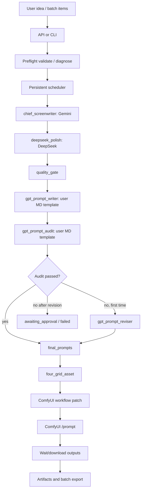

# Full Auto LTX Short Video Agent Productization Implementation Plan

> **For agentic workers:** REQUIRED SUB-SKILL: Use superpowers:subagent-driven-development (recommended) or superpowers:executing-plans to implement this plan task-by-task. Steps use checkbox (`- [ ]`) syntax for tracking.

**Goal:** 把 Relief Story Agent 从“API 核心能力已成型”推进到“粉丝可本地部署、批量全自动生成 LTX 2.3 短视频”的完整软件。

**Architecture:** 保持 API-first 后端为核心，继续复用现有多模型流水线、持久化调度器、LTX 四宫格适配器、ComfyUI 提交和 artifact/export 体系。先做真实本机联调和命令行/配置体验，再做 UI 或桌面壳，避免在核心链路没跑实前把复杂度堆到界面上。

**Tech Stack:** Python 3.11+, FastAPI, Pydantic v2, httpx, OpenAI-compatible text/image APIs, ComfyUI, LTX 2.3 workflow JSON, Pillow, pytest, Windows PowerShell/batch launcher

---

## 0. 需求复述

用户要做的是一个面向本地部署的“批量全自动短片生成 agent”，最终可以分享给粉丝随意使用。第一阶段不优先做 UI，但核心体验要专业：用户给主题、模板、模型配置和 ComfyUI 工作流后，软件能自动完成从编剧到 LTX 2.3 视频入队、输出收集、批量导出。

内容定位不是泛泛“治愈短片”，而是“压力人群的低刺激情绪缓冲短片”。每条视频 60-120 秒，观感是被理解、可以慢一点、今天没那么糟、世界还有柔软处。系统必须支持现实、奇幻、Q 版、生活流、温柔喜剧等风格，且每个故事有明确内核。

固定工序必须保持：

```text
chief_screenwriter
-> deepseek_polish
-> quality_gate
-> gpt_prompt_writer
-> gpt_prompt_audit
-> gpt_prompt_reviser (最多一次)
-> final_prompts
-> four_grid_asset
-> artifacts
-> comfyui
```

关键约束：

- Gemini 阶段是 `chief_screenwriter` 总编剧，不是单一治愈模板生成器。
- DeepSeek 改稿增强戏剧性和细节，但不能提高刺激强度。
- 质量门禁只放在 DeepSeek 改稿之后。
- GPT 提示词撰写和 GPT 提示词漏洞检查都必须支持用户替换 Markdown 模板。
- 提示词漏洞检查覆盖角色站位、空间关系、越轴、动态画面逻辑、静态画面逻辑、镜头语言与剧情对应、每个镜头的叙事含义。
- 自动修正提示词只允许一次。
- GPT Image 2 四宫格提示词要适中，不写成超长堆词。
- ComfyUI 第一版只读取用户提供的 workflow API/LiteGraph JSON，不自动生成节点图。
- 最终判断“完整做好”必须以真实本地端到端视频产出和批量导出为准，不能只看单元测试。

## 1. 当前真实进度

本地仓库：`D:\codex工作区`

GitHub 仓库：`https://github.com/AharaOoO/relief-story-agent`

当前关键状态：

- `local_comfyui_smoke` 已实现。
- LiteGraph submit 路径已接入 ComfyUI `/object_info`：补齐 runtime-required widget、动态 combo 子字段、本地 COMBO 资产名别名，并验证缺失 node class。
- 已用本机 ComfyUI 跑通真实 ready workflow `/prompt` 入队。

已实现能力：

- API-first 服务与 `python -m relief_story_agent.server` 启动入口。
- Windows 一键启动脚本 `start_relief_story_agent.bat`。
- 多模型阶段配置、模型 profile、环境变量密钥检查、OpenAI-compatible 调用层。
- `chief_screenwriter -> deepseek_polish -> quality_gate` 创作链路。
- `gpt_prompt_writer -> gpt_prompt_audit -> gpt_prompt_reviser` 提示词链路。
- `prompt_writer_template_path` 和 `prompt_audit_template_path` 本地 Markdown 模板覆盖。
- `relief-story-agent template-check` 可独立校验 writer/audit 模板占位符和 sha256 指纹。
- DeepSeek 后质量门禁、提示词 audit 后最多一次自动修正。
- GPT Image 2 四宫格提示词长度压缩。
- ComfyUI workflow 分析、预览、patch、`/upload/image`、`/prompt`。
- LTX 2.3 LiteGraph 自动注入点识别。
- 用户 LTX 2.3 四宫格工作流结构已在 fixture 中验证：`202` LTX JSON、`37` seed、`79` filename prefix、`196` LoadImage、`221` TD_LTXVAddGuideFromGrid、2x2 grid。
- `four_grid_asset` 阶段：四宫格提示词编译、手动图覆盖、自动图生成 provider、图像校验、上传 checkpoint。
- 持久化调度器、批量任务、重试、暂停、恢复、取消、失败分类、recovery plan。
- artifact manifest、batch export、zip/checksum/export validation。
- metrics、health、config validate/diagnose。
- 本地 ComfyUI smoke runner：`relief_story_agent/smoke_comfyui.py`、`POST /api/smoke/comfyui`、CLI dry-run/real-run、artifact 写出、mock ComfyUI 测试。
- 本地验收证据收集器：`relief-story-agent local-acceptance` 会运行 `compileall`、全量 pytest，并可选收集 `smoke-comfyui` 结果，生成可交给另一个 AI 核查的 JSON/Markdown 报告。
- 真实本机 smoke 证据：

```text
python -m relief_story_agent.smoke_comfyui --request "D:/relief_story_inputs/local_ltx_ready_smoke_request.real.json"
status=passed
ready=true
prompt_id=31037f9b-b8c8-5919-b717-fbe3c7e634eb
artifact_dir=D:\relief_story_smoke\comfyui_smoke_20260625T115742676759Z
```

最新本地验证基线在新增 smoke runner 后应为：

```powershell
python -m compileall -q relief_story_agent
python -m pytest relief_story_agent/tests -q
```

当前已验证：`324 passed`。

尚未完成或尚未真实证明：

- 没有用真实 Gemini/DeepSeek/GPT 模型配置跑完整链路。
- 已用用户本机 ComfyUI + LTX 2.3 ready workflow 证明 `/prompt` 可入队；但还没有等待真实视频渲染完成并下载验收。
- 没有形成面向粉丝的配置向导、安装包、清晰本地部署流程。
- 没有模板库版本管理与模板示例包。
- 没有非开发者友好的批量任务入口。
- 没有完整的“从干净机器安装到产出视频”的验收报告。
- UI/桌面壳未做。

因此当前结论是：**后端核心 alpha 已经相当厚实，但“除了 UI 外的全自动短片生成软件”还没有完成。**

## 2. 完整完成定义

只有满足以下清单，才能在交接里说“除了 UI 外已基本完整”：

- 干净 Windows 环境按文档安装后能启动 API。
- 用户只配置模型环境变量、模板路径、ComfyUI endpoint、LTX workflow 路径、输出目录，就能创建 run。
- 单条 run 从 idea 自动走完多模型编剧、提示词 audit、四宫格图、ComfyUI 入队、渲染等待、视频下载、artifact/export。
- 至少 5 条 batch 能连续运行，单条失败不会拖垮整个批次。
- 中途关闭 API 后重启，已入队/运行状态能恢复或给出明确 recovery plan。
- ComfyUI 失败、模板错误、模型鉴权错误、prompt audit 不通过都有用户可理解的诊断。
- batch export 能生成 publish index、视频文件夹、zip 和校验报告。
- README、交接文档、示例配置、常见错误说明可以让另一个会话或普通用户接手。
- 全量单元测试通过，并且有一份真实本机端到端验收 artifact。

## 3. 文件地图

### 已有核心文件

- `relief_story_agent/server.py`：命令行 server 入口。
- `relief_story_agent/api.py`：FastAPI 路由。
- `relief_story_agent/models.py`：Run、Batch、ComfyUI、模型配置等 Pydantic 类型。
- `relief_story_agent/orchestrator.py`：主流水线编排。
- `relief_story_agent/providers.py`：模型 provider。
- `relief_story_agent/model_runtime.py`：模型调用、重试、限流、成本统计。
- `relief_story_agent/prompt_templates.py`：默认模板与用户 Markdown 模板渲染。
- `relief_story_agent/quality.py`：剧本质量门禁。
- `relief_story_agent/output_contracts.py`：模型输出结构约束。
- `relief_story_agent/comfyui.py`：ComfyUI 分析、预览、提交、等待、下载、取消。
- `relief_story_agent/ltx_workflow.py`：LTX LiteGraph 检测和 patch。
- `relief_story_agent/grid_image.py`：四宫格提示词编译和图像校验。
- `relief_story_agent/image_providers.py`：OpenAI-compatible 图像生成。
- `relief_story_agent/smoke_comfyui.py`：本地 ComfyUI smoke runner。
- `relief_story_agent/scheduler.py`：持久化后台调度。
- `relief_story_agent/storage.py`：run/batch JSON 存储。
- `relief_story_agent/artifacts.py`：artifact、export、publish index。
- `relief_story_agent/config_validation.py`：配置验证和诊断。
- `relief_story_agent/recovery.py`：batch recovery plan。
- `relief_story_agent/metrics.py`：系统和批量健康指标。

### 需要新增或重点补强的文件

- `docs/superpowers/plans/2026-06-25-full-auto-ltx-agent-productization.md`：本文件，总交接计划。
- `relief_story_agent/examples/smoke_request.example.json`：真实 smoke 请求示例。
- `relief_story_agent/examples/run_request.full-ltx.example.json`：真实单条全链路请求示例。
- `relief_story_agent/examples/batch_request.full-ltx.example.json`：真实批量请求示例。
- `relief_story_agent/examples/model_config.local.example.json`：本地多模型配置示例。
- `relief_story_agent/examples/templates/prompt_writer.default.md`：可编辑提示词撰写模板示例。
- `relief_story_agent/examples/templates/prompt_audit.default.md`：可编辑漏洞检查模板示例。
- `relief_story_agent/cli.py`：后续统一命令行入口，包装 validate、smoke、run、batch、export。
- `relief_story_agent/setup_wizard.py`：后续本地配置向导，生成配置文件和请求样例。
- `relief_story_agent/acceptance.py`：后续真实本机验收脚本，记录端到端报告。
- `relief_story_agent/tests/test_cli.py`：CLI 行为测试。
- `relief_story_agent/tests/test_setup_wizard.py`：配置向导测试。
- `relief_story_agent/tests/test_acceptance.py`：验收报告生成测试。
- `docs/LOCAL_DEPLOYMENT.md`：粉丝本地部署说明。
- `docs/TEMPLATE_GUIDE.md`：提示词模板迭代说明。
- `docs/COMFYUI_LTX23_GUIDE.md`：LTX 2.3 工作流接入和排错说明。
- `docs/ACCEPTANCE_REPORT_TEMPLATE.md`：真实验收记录模板。

## 4. 目标架构



## 5. 实施路线

### Task 1: 推送当前 smoke runner 和总计划

**Files:**

- Modify: `README.md`
- Modify: `PROJECT_HANDOFF.md`
- Modify: `NEXT_SESSION_PROMPT.md`
- Create: `docs/superpowers/plans/2026-06-25-full-auto-ltx-agent-productization.md`

- [ ] **Step 1: 核对本地状态**

Run:

```powershell
git status --short --branch
git log --oneline --decorate -5
```

Expected:

```text
## master...origin/master [ahead 1]
80da952 (HEAD -> master) feat: add local ComfyUI smoke runner
```

- [ ] **Step 2: 更新文档入口**

把 `README.md` 的“先读文件”改成优先阅读本总计划，并把 `local_comfyui_smoke` 从“下一步实现”改为“本地已实现，下一步真实联调”。

- [ ] **Step 3: 更新交接文档**

把 `PROJECT_HANDOFF.md` 的当前进度改为：smoke runner 已实现；下一阶段是用真实 workflow 和真实 ComfyUI 做 dry-run、real-run、再接真实模型。

- [ ] **Step 4: 更新新会话提示词**

把 `NEXT_SESSION_PROMPT.md` 改成让新会话先读本计划，确认 smoke runner 提交是否已推送，然后做真实本机验收。

- [ ] **Step 5: 验证**

Run:

```powershell
git diff --check
python -m compileall -q relief_story_agent
python -m pytest relief_story_agent/tests -q
```

Expected: no whitespace errors, compile exit code 0, pytest 全量通过。

- [ ] **Step 6: 提交并推送**

Run:

```powershell
git add README.md PROJECT_HANDOFF.md NEXT_SESSION_PROMPT.md docs/superpowers/plans/2026-06-25-full-auto-ltx-agent-productization.md
git commit -m "docs: add full auto LTX agent development plan"
git push
git status --short --branch
```

Expected: GitHub `master` 包含 smoke runner commit 和本计划 commit，本地不再 ahead。

### Task 2: 本机真实 ComfyUI smoke 验收

**Files:**

- Create: `relief_story_agent/examples/smoke_request.example.json`
- Modify: `relief_story_agent/README.md`
- Modify: `docs/COMFYUI_LTX23_GUIDE.md`
- Test: `relief_story_agent/tests/test_deployment_examples.py`

- [ ] **Step 1: 写示例文件测试**

Add or extend `relief_story_agent/tests/test_deployment_examples.py`:

```python
from __future__ import annotations

import json
from pathlib import Path


def test_smoke_request_example_is_valid_json():
    path = Path("relief_story_agent/examples/smoke_request.example.json")
    payload = json.loads(path.read_text(encoding="utf-8"))
    assert payload["workflow_path"].endswith(".json")
    assert payload["comfyui_base_url"].startswith("http://")
    assert payload["manual_grid_image_path"].lower().endswith((".png", ".jpg", ".jpeg", ".webp"))
    assert payload["dry_run"] is True
```

- [ ] **Step 2: Run RED**

Run:

```powershell
python -m pytest relief_story_agent/tests/test_deployment_examples.py::test_smoke_request_example_is_valid_json -q
```

Expected: FAIL because the example file is missing.

- [ ] **Step 3: Create smoke request example**

Create `relief_story_agent/examples/smoke_request.example.json`:

```json
{
  "workflow_path": "C:/Users/dcf/Downloads/AI代码侠土豆-LTX-2.3 4宫格V3.0 红果短剧特调版 半自动(带运镜版).json",
  "comfyui_base_url": "http://127.0.0.1:8188",
  "final_storyboard": [
    {
      "shot_id": 1,
      "time_range": "0-15s",
      "description": "雨夜便利店窗边，一个疲惫上班族看着热汤冒气，情绪慢慢放松。",
      "image_prompt": "雨夜便利店窗边，疲惫上班族，热汤白雾，柔和霓虹倒影，低刺激，温暖现实风格",
      "negative_prompt": "争吵，暴力，恐怖，混乱，强压迫，文字，水印，畸形手",
      "comfyui_inputs": {
        "seed": 123456,
        "filename_prefix": "smoke_relief_story"
      }
    }
  ],
  "manual_grid_image_path": "D:/relief_story_inputs/four_grid_smoke.png",
  "output_root": "D:/relief_story_smoke",
  "run_id": "smoke_relief_story",
  "dry_run": true
}
```

- [ ] **Step 4: Run GREEN**

Run:

```powershell
python -m pytest relief_story_agent/tests/test_deployment_examples.py::test_smoke_request_example_is_valid_json -q
```

Expected: PASS.

- [ ] **Step 5: 手动 dry-run 验收**

用户准备一张 1024x1024 四宫格图到 `D:/relief_story_inputs/four_grid_smoke.png` 后运行：

```powershell
python -m relief_story_agent.smoke_comfyui --request relief_story_agent/examples/smoke_request.example.json --dry-run
```

Expected:

```text
status=passed
ready=true
artifact_dir=...
```

Artifact directory must contain:

```text
smoke_request.json
smoke_preflight.json
smoke_grid_image.png
smoke_workflow_patched.json
smoke_result.json
smoke_logs.jsonl
```

- [ ] **Step 6: 手动 real-run 验收**

Start ComfyUI, then run:

```powershell
python -m relief_story_agent.smoke_comfyui --request relief_story_agent/examples/smoke_request.example.json
```

Expected:

```text
status=passed
ready=true
prompt_id=<non-empty>
artifact_dir=...
```

ComfyUI queue/history should show the submitted prompt.

### Task 3: 模板示例包和模板验证体验

**Files:**

- Create: `relief_story_agent/examples/templates/prompt_writer.default.md`
- Create: `relief_story_agent/examples/templates/prompt_audit.default.md`
- Modify: `relief_story_agent/examples/run_request.example.json`
- Create: `docs/TEMPLATE_GUIDE.md`
- Test: `relief_story_agent/tests/test_deployment_examples.py`

- [ ] **Step 1: 写模板文件存在性测试**

Add:

```python
def test_prompt_template_examples_contain_required_placeholders():
    writer = Path("relief_story_agent/examples/templates/prompt_writer.default.md").read_text(encoding="utf-8")
    audit = Path("relief_story_agent/examples/templates/prompt_audit.default.md").read_text(encoding="utf-8")
    assert "{{script_json}}" in writer
    assert "{{duration_seconds}}" in writer
    assert "{{preferred_style}}" in writer
    assert "{{script_json}}" in audit
    assert "{{storyboard_json}}" in audit
```

- [ ] **Step 2: Run RED**

Run:

```powershell
python -m pytest relief_story_agent/tests/test_deployment_examples.py::test_prompt_template_examples_contain_required_placeholders -q
```

Expected: FAIL because template example files are missing.

- [ ] **Step 3: Create writer template example**

Create `relief_story_agent/examples/templates/prompt_writer.default.md` with concise LTX/GPT Image 2 guidance:

```markdown
# gpt_prompt_writer 模板

你是短视频分镜与 LTX 提示词撰写者。请根据 DeepSeek 改好的剧本输出 5-8 个镜头，每个镜头服务剧情，不写无意义空镜。

输入剧本：
{{script_json}}

目标时长：{{duration_seconds}} 秒
偏好风格：{{preferred_style}}
工作流上下文：
{{workflow_context}}

要求：
- 每个 `image_prompt` 控制在 60-120 个中文字符左右。
- 保持角色位置、空间方向、物件关系连续。
- 镜头语言必须符合剧情含义。
- 输出 JSON：`shots[]`，每个 shot 包含 `shot_id`、`time_range`、`description`、`image_prompt`、`negative_prompt`、`comfyui_inputs`。
```

- [ ] **Step 4: Create audit template example**

Create `relief_story_agent/examples/templates/prompt_audit.default.md`:

```markdown
# gpt_prompt_audit 模板

你是提示词漏洞检查员。检查第 4 步分镜提示词是否适合交给 LTX/ComfyUI。

剧本：
{{script_json}}

分镜：
{{storyboard_json}}

工作流上下文：
{{workflow_context}}

请检查：
- 角色站位是否前后矛盾。
- 空间关系是否错乱。
- 是否越轴。
- 动态画面逻辑是否能连续。
- 静态画面逻辑是否符合剧情。
- 镜头语言是否表达了剧情文意。
- 每个镜头是否有叙事含义。

输出 JSON：`passed`、`issues`、`revision_instructions`、`scores`。
```

- [ ] **Step 5: Run GREEN**

Run:

```powershell
python -m pytest relief_story_agent/tests/test_deployment_examples.py::test_prompt_template_examples_contain_required_placeholders -q
```

Expected: PASS.

### Task 4: 真实模型配置和单条全链路请求示例

**Files:**

- Create: `relief_story_agent/examples/model_config.local.example.json`
- Create: `relief_story_agent/examples/run_request.full-ltx.example.json`
- Modify: `docs/LOCAL_DEPLOYMENT.md`
- Test: `relief_story_agent/tests/test_deployment_examples.py`

- [ ] **Step 1: 写示例 JSON 测试**

Add:

```python
def test_full_ltx_run_examples_are_valid_json():
    model_config = json.loads(Path("relief_story_agent/examples/model_config.local.example.json").read_text(encoding="utf-8"))
    run_request = json.loads(Path("relief_story_agent/examples/run_request.full-ltx.example.json").read_text(encoding="utf-8"))
    assert "profiles" in model_config
    assert "stages" in model_config
    assert model_config["stages"]["chief_screenwriter"]
    assert run_request["idea"]
    assert run_request["approval_mode"] in {"auto", "manual"}
    assert run_request["template_paths"]["prompt_writer_template_path"].endswith(".md")
    assert run_request["comfyui"]["enabled"] is True
    assert run_request["comfyui"]["workflow_api_path"].endswith(".json")
```

- [ ] **Step 2: Create model config example**

Create `relief_story_agent/examples/model_config.local.example.json`:

```json
{
  "profiles": {
    "gemini_writer": {
      "base_url": "https://YOUR_GEMINI_OPENAI_COMPATIBLE_ENDPOINT/v1",
      "api_key_env": "GEMINI_API_KEY",
      "model": "YOUR_GEMINI_MODEL",
      "temperature": 0.8,
      "timeout_seconds": 90
    },
    "deepseek_editor": {
      "base_url": "https://YOUR_DEEPSEEK_OPENAI_COMPATIBLE_ENDPOINT/v1",
      "api_key_env": "DEEPSEEK_API_KEY",
      "model": "deepseek-reasoner-or-v4-pro",
      "temperature": 0.7,
      "timeout_seconds": 120
    },
    "gpt_visual": {
      "base_url": "https://api.openai.com/v1",
      "api_key_env": "OPENAI_API_KEY",
      "model": "gpt-4.1-or-current-json-capable-model",
      "temperature": 0.4,
      "timeout_seconds": 90
    }
  },
  "stages": {
    "chief_screenwriter": "gemini_writer",
    "deepseek_polish": "deepseek_editor",
    "gpt_prompt_writer": "gpt_visual",
    "gpt_prompt_audit": "gpt_visual",
    "gpt_prompt_reviser": "gpt_visual"
  }
}
```

- [ ] **Step 3: Create full run request example**

Create `relief_story_agent/examples/run_request.full-ltx.example.json`:

```json
{
  "idempotency_key": "relief-single-demo-001",
  "idea": "雨夜下班后，一个疲惫的人在便利店被一碗热汤轻轻接住",
  "audience_pressure": "长期加班、情绪内耗、感觉没人看见自己的普通上班族",
  "preferred_series": "便利店的夜晚",
  "preferred_style": "现实温柔，低刺激，雨夜霓虹，生活流",
  "duration_seconds": 90,
  "approval_mode": "auto",
  "output_root": "D:/relief_story_runs",
  "template_paths": {
    "prompt_writer_template_path": "D:/relief_story_templates/prompt_writer.default.md",
    "prompt_audit_template_path": "D:/relief_story_templates/prompt_audit.default.md"
  },
  "comfyui": {
    "enabled": true,
    "endpoint": "http://127.0.0.1:8188",
    "workflow_api_path": "C:/Users/dcf/Downloads/AI代码侠土豆-LTX-2.3 4宫格V3.0 红果短剧特调版 半自动(带运镜版).json",
    "wait_for_completion": true,
    "download_outputs": true,
    "output_timeout_seconds": 1200,
    "grid_image": {
      "mode": "auto",
      "provider": "openai_compatible",
      "base_url": "https://api.openai.com/v1",
      "api_key_env": "OPENAI_API_KEY",
      "model": "gpt-image-2",
      "size": "1024x1024",
      "quality": "medium",
      "output_format": "png"
    }
  }
}
```

- [ ] **Step 4: Run validation**

Run:

```powershell
python -m pytest relief_story_agent/tests/test_deployment_examples.py::test_full_ltx_run_examples_are_valid_json -q
```

Expected: PASS.

- [ ] **Step 5: Manual preflight command**

Start server:

```powershell
python -m relief_story_agent.server --host 127.0.0.1 --port 8891 --state-dir D:/relief_story_state --model-config relief_story_agent/examples/model_config.local.example.json
```

Then call:

```powershell
Invoke-RestMethod -Method Post -Uri "http://127.0.0.1:8891/api/config/diagnose?check_comfyui_connection=true" -ContentType "application/json" -InFile "relief_story_agent/examples/run_request.full-ltx.example.json"
```

Expected: `ready=true` after the user has set env vars, template files, workflow path, ComfyUI, and output root.

### Task 5: 单条真实端到端验收

**Files:**

- Create: `relief_story_agent/acceptance.py`
- Create: `relief_story_agent/tests/test_acceptance.py`
- Modify: `docs/ACCEPTANCE_REPORT_TEMPLATE.md`

- [ ] **Step 1: 写验收报告测试**

Create `relief_story_agent/tests/test_acceptance.py`:

```python
from __future__ import annotations

import json
from pathlib import Path

from relief_story_agent.acceptance import write_acceptance_report


def test_write_acceptance_report_records_required_fields(tmp_path):
    report_path = write_acceptance_report(
        tmp_path,
        {
            "run_id": "run_demo",
            "batch_id": "",
            "mode": "single_run",
            "status": "completed",
            "video_paths": ["D:/relief_story_runs/run_demo/output.mp4"],
            "checks": [{"id": "video_exists", "status": "pass"}],
            "notes": "local acceptance demo"
        },
    )
    payload = json.loads(Path(report_path).read_text(encoding="utf-8"))
    assert payload["mode"] == "single_run"
    assert payload["status"] == "completed"
    assert payload["video_paths"]
    assert payload["checks"][0]["id"] == "video_exists"
```

- [ ] **Step 2: Run RED**

Run:

```powershell
python -m pytest relief_story_agent/tests/test_acceptance.py -q
```

Expected: FAIL because `relief_story_agent.acceptance` is missing.

- [ ] **Step 3: Implement acceptance report helper**

Create `relief_story_agent/acceptance.py`:

```python
from __future__ import annotations

import json
from datetime import datetime, timezone
from pathlib import Path
from typing import Any


def write_acceptance_report(output_dir: str | Path, payload: dict[str, Any]) -> str:
    target_dir = Path(output_dir)
    target_dir.mkdir(parents=True, exist_ok=True)
    report = {
        "generated_at": datetime.now(timezone.utc).isoformat(),
        "run_id": str(payload.get("run_id") or ""),
        "batch_id": str(payload.get("batch_id") or ""),
        "mode": str(payload.get("mode") or ""),
        "status": str(payload.get("status") or ""),
        "video_paths": list(payload.get("video_paths") or []),
        "checks": list(payload.get("checks") or []),
        "notes": str(payload.get("notes") or ""),
    }
    path = target_dir / "acceptance_report.json"
    path.write_text(json.dumps(report, ensure_ascii=False, indent=2), encoding="utf-8")
    return str(path)
```

- [ ] **Step 4: Run GREEN**

Run:

```powershell
python -m pytest relief_story_agent/tests/test_acceptance.py -q
```

Expected: PASS.

- [ ] **Step 5: Manual single-run acceptance**

After config diagnose returns `ready=true`, call:

```powershell
Invoke-RestMethod -Method Post -Uri "http://127.0.0.1:8891/api/runs?preflight=true&check_comfyui_connection=true" -ContentType "application/json" -InFile "relief_story_agent/examples/run_request.full-ltx.example.json"
```

Poll:

```powershell
Invoke-RestMethod "http://127.0.0.1:8891/api/runs/{run_id}"
Invoke-RestMethod "http://127.0.0.1:8891/api/runs/{run_id}/artifacts"
```

Expected:

- `status=completed`
- `final_storyboard` is non-empty
- `grid_image_asset.local_path` exists
- `comfyui_prompt_ids` has at least one id
- downloaded video output exists when `wait_for_completion=true` and `download_outputs=true`

Do not mark this milestone complete until a real video path exists and opens locally.

### Task 6: 批量真实验收与恢复演练

**Files:**

- Create: `relief_story_agent/examples/batch_request.full-ltx.example.json`
- Modify: `docs/LOCAL_DEPLOYMENT.md`
- Test: `relief_story_agent/tests/test_deployment_examples.py`

- [ ] **Step 1: Create batch example test**

Add:

```python
def test_full_ltx_batch_example_has_multiple_items_and_failure_policy():
    payload = json.loads(Path("relief_story_agent/examples/batch_request.full-ltx.example.json").read_text(encoding="utf-8"))
    assert payload["idempotency_key"]
    assert len(payload["items"]) >= 3
    assert payload["defaults"]["approval_mode"] == "auto"
    assert "failure_policy" in payload
    assert payload["failure_policy"]["pause_on_failure_count"] >= 1
```

- [ ] **Step 2: Create batch request example**

Create a batch with at least three series directions:

```json
{
  "idempotency_key": "relief-batch-demo-001",
  "failure_policy": {
    "auto_retry_failed_items": 1,
    "pause_on_failure_count": 2,
    "pause_on_failure_rate": 0.5
  },
  "defaults": {
    "approval_mode": "auto",
    "output_root": "D:/relief_story_runs",
    "duration_seconds": 90,
    "template_paths": {
      "prompt_writer_template_path": "D:/relief_story_templates/prompt_writer.default.md",
      "prompt_audit_template_path": "D:/relief_story_templates/prompt_audit.default.md"
    },
    "comfyui": {
      "enabled": true,
      "endpoint": "http://127.0.0.1:8188",
      "workflow_api_path": "C:/Users/dcf/Downloads/AI代码侠土豆-LTX-2.3 4宫格V3.0 红果短剧特调版 半自动(带运镜版).json",
      "wait_for_completion": true,
      "download_outputs": true,
      "output_timeout_seconds": 1200,
      "grid_image": {
        "mode": "auto",
        "provider": "openai_compatible",
        "base_url": "https://api.openai.com/v1",
        "api_key_env": "OPENAI_API_KEY",
        "model": "gpt-image-2",
        "size": "1024x1024",
        "quality": "medium",
        "output_format": "png"
      }
    }
  },
  "items": [
    {
      "idea": "便利店夜晚，多放的一双筷子",
      "preferred_series": "便利店的夜晚",
      "preferred_style": "现实温柔，低刺激"
    },
    {
      "idea": "肩膀上的压力小怪物被一杯热豆浆安抚",
      "preferred_series": "压力小怪物",
      "preferred_style": "都市奇幻，柔和可爱"
    },
    {
      "idea": "未完成文件夹小人给任务盖小被子",
      "preferred_series": "未完成事务所",
      "preferred_style": "Q版萌系，轻喜剧"
    }
  ]
}
```

- [ ] **Step 3: Run batch plan**

Run:

```powershell
Invoke-RestMethod -Method Post -Uri "http://127.0.0.1:8891/api/batches/plan?check_comfyui_connection=true" -ContentType "application/json" -InFile "relief_story_agent/examples/batch_request.full-ltx.example.json"
```

Expected: `will_enqueue=false`, validation visible, item order visible.

- [ ] **Step 4: Run real batch**

Run:

```powershell
Invoke-RestMethod -Method Post -Uri "http://127.0.0.1:8891/api/batches?preflight=true&check_comfyui_connection=true" -ContentType "application/json" -InFile "relief_story_agent/examples/batch_request.full-ltx.example.json"
```

Expected: returns `batch_id`, each item has `run_id`.

- [ ] **Step 5: Restart recovery drill**

While batch is queued or running:

1. Stop server.
2. Start server again with same `--state-dir`.
3. Call:

```powershell
Invoke-RestMethod "http://127.0.0.1:8891/api/batches/{batch_id}/recovery-plan"
Invoke-RestMethod "http://127.0.0.1:8891/api/batches/{batch_id}"
```

Expected: no lost batch; queued/expired running work is recovered or manual blockers are explicit.

- [ ] **Step 6: Export and validate**

Run:

```powershell
Invoke-RestMethod -Method Post -Uri "http://127.0.0.1:8891/api/batches/{batch_id}/export" -ContentType "application/json" -Body '{"export_root":"D:/relief_story_exports","include_zip":true}'
Invoke-RestMethod -Method Post -Uri "http://127.0.0.1:8891/api/batches/{batch_id}/export/validate" -ContentType "application/json" -Body '{"export_dir":"D:/relief_story_exports/{batch_id}","save_report":true}'
```

Expected: publish index, publish videos, zip, checksum, validation report.

### Task 7: 统一 CLI 和本地部署体验

**Files:**

- Create: `relief_story_agent/cli.py`
- Modify: `pyproject.toml`
- Create: `relief_story_agent/tests/test_cli.py`
- Create: `docs/LOCAL_DEPLOYMENT.md`

- [ ] **Step 1: Write CLI smoke test**

Create `relief_story_agent/tests/test_cli.py`:

```python
from __future__ import annotations

import subprocess
import sys


def test_cli_help_lists_core_commands():
    completed = subprocess.run(
        [sys.executable, "-m", "relief_story_agent.cli", "--help"],
        capture_output=True,
        text=True,
        timeout=30,
    )
    assert completed.returncode == 0
    assert "validate" in completed.stdout
    assert "smoke-comfyui" in completed.stdout
    assert "serve" in completed.stdout
```

- [ ] **Step 2: Run RED**

Run:

```powershell
python -m pytest relief_story_agent/tests/test_cli.py -q
```

Expected: FAIL because `relief_story_agent.cli` is missing.

- [ ] **Step 3: Implement minimal CLI help**

Create `relief_story_agent/cli.py`:

```python
from __future__ import annotations

import argparse

from .server import main as server_main
from .smoke_comfyui import main as smoke_main


def main(argv: list[str] | None = None) -> int:
    parser = argparse.ArgumentParser(prog="relief-story-agent")
    subparsers = parser.add_subparsers(dest="command")
    subparsers.add_parser("serve", help="Start the local API server.")
    subparsers.add_parser("smoke-comfyui", help="Run local ComfyUI smoke verification.")
    subparsers.add_parser("validate", help="Validate configuration through the API or request files.")
    args, rest = parser.parse_known_args(argv)
    if args.command == "serve":
        return server_main(rest)
    if args.command == "smoke-comfyui":
        return smoke_main(rest)
    if args.command == "validate":
        parser.error("validate requires implementation in the next step")
    parser.print_help()
    return 0


if __name__ == "__main__":
    raise SystemExit(main())
```

- [ ] **Step 4: Update pyproject script**

Change `pyproject.toml`:

```toml
[project.scripts]
relief-story-agent = "relief_story_agent.cli:main"
relief-story-agent-server = "relief_story_agent.server:main"
```

- [ ] **Step 5: Run GREEN**

Run:

```powershell
python -m pytest relief_story_agent/tests/test_cli.py -q
```

Expected: PASS.

### Task 8: 配置向导

**Files:**

- Create: `relief_story_agent/setup_wizard.py`
- Create: `relief_story_agent/tests/test_setup_wizard.py`
- Modify: `relief_story_agent/cli.py`

- [ ] **Step 1: Write config generator test**

Create `relief_story_agent/tests/test_setup_wizard.py`:

```python
from __future__ import annotations

import json
from pathlib import Path

from relief_story_agent.setup_wizard import write_local_config_bundle


def test_write_local_config_bundle_creates_expected_files(tmp_path):
    result = write_local_config_bundle(
        tmp_path,
        workflow_path="C:/Users/dcf/Downloads/workflow.json",
        comfyui_endpoint="http://127.0.0.1:8188",
        output_root="D:/relief_story_runs",
    )
    assert Path(result["model_config"]).exists()
    assert Path(result["run_request"]).exists()
    assert Path(result["batch_request"]).exists()
    assert Path(result["prompt_writer_template"]).exists()
    assert Path(result["prompt_audit_template"]).exists()
    run_payload = json.loads(Path(result["run_request"]).read_text(encoding="utf-8"))
    assert run_payload["comfyui"]["workflow_api_path"] == "C:/Users/dcf/Downloads/workflow.json"
```

- [ ] **Step 2: Implement config bundle writer**

Create a focused writer that copies example templates and writes user-specific JSON. It must not write API keys; it writes `api_key_env` names only.

- [ ] **Step 3: Add CLI command**

Add `setup` command:

```powershell
python -m relief_story_agent.cli setup --output-dir D:/relief_story_config --workflow-path "C:/.../workflow.json" --comfyui-endpoint http://127.0.0.1:8188 --output-root D:/relief_story_runs
```

Expected output lists generated files and next commands.

### Task 9: 发布前文档和常见错误

**Files:**

- Create: `docs/LOCAL_DEPLOYMENT.md`
- Create: `docs/COMFYUI_LTX23_GUIDE.md`
- Create: `docs/TEMPLATE_GUIDE.md`
- Modify: `README.md`

- [ ] **Step 1: Write deployment doc checklist**

`docs/LOCAL_DEPLOYMENT.md` must include:

- Python 3.11 安装。
- `python -m pip install -e .`
- 环境变量：`GEMINI_API_KEY`、`DEEPSEEK_API_KEY`、`OPENAI_API_KEY`。
- ComfyUI 启动检查：`http://127.0.0.1:8188`。
- 运行 `setup`。
- 运行 `diagnose`。
- 运行 `smoke-comfyui --dry-run`。
- 运行 real smoke。
- 运行单条 run。
- 运行 batch。
- export 和 validate。

- [ ] **Step 2: Write ComfyUI guide**

`docs/COMFYUI_LTX23_GUIDE.md` must include:

- 支持 LiteGraph 和 API prompt JSON。
- 用户工作流语义注入点。
- 为什么不自动生成节点图。
- 四宫格图要求。
- 常见错误：workflow path 不存在、ComfyUI 没启动、LoadImage 节点没检测到、prompt 失败、显存不足。

- [ ] **Step 3: Write template guide**

`docs/TEMPLATE_GUIDE.md` must include:

- writer/audit 模板占位符。
- GPT Image 2 四宫格提示词长度建议。
- audit 关注点。
- 模板迭代流程：改模板、validate、single run、检查 artifact、batch。

### Task 10: 最终验收矩阵

**Files:**

- Create: `docs/ACCEPTANCE_REPORT_TEMPLATE.md`
- Modify: `PROJECT_HANDOFF.md`
- Modify: `NEXT_SESSION_PROMPT.md`

- [ ] **Step 1: Create acceptance template**

`docs/ACCEPTANCE_REPORT_TEMPLATE.md` must include this table:

```markdown
| Check | Required Evidence | Status |
| --- | --- | --- |
| Full tests | `python -m pytest relief_story_agent/tests -q` output | |
| ComfyUI dry smoke | `smoke_result.json`, no prompt id | |
| ComfyUI real smoke | `smoke_result.json`, prompt id | |
| Single run | run artifact dir, downloaded video path | |
| Batch run | batch id, item summaries | |
| Restart recovery | recovery-plan before/after restart | |
| Export | publish index, zip, sha256 | |
| Fresh setup | commands from docs run on clean env | |
```

- [ ] **Step 2: Update handoff**

Only mark “除了 UI 外基本完成” when every row has evidence.

- [ ] **Step 3: Push final docs**

Run:

```powershell
git add README.md PROJECT_HANDOFF.md NEXT_SESSION_PROMPT.md docs relief_story_agent pyproject.toml
git commit -m "docs: add local deployment and acceptance guides"
git push
```

Use a narrower `git add` if unrelated files appear in `git status`.

## 6. 开发纪律

- 不要用 `git add .`，因为 `D:\codex工作区` 下有其他项目。
- 不要提交 API key、模型权重、ComfyUI 输出视频、用户私有 workflow 原件。
- 先写测试再实现，尤其是 CLI、配置向导、acceptance helper。
- 每个 milestone 单独提交，提交信息清楚。
- 不要改变固定工序顺序。
- 不要把用户可迭代模板写死进代码。
- 不要把提示词修正循环改回多次或无限。
- 不要在 smoke runner 里调用大模型。
- 不要把 UI 作为“完成核心链路”的替代品。
- 每次说“完成”前必须给出命令输出或 artifact 证据。

## 7. 交接启动指令

另一个会话可以直接从这段开始：

```text
请接手 D:\codex工作区 的 relief-story-agent 项目。先阅读 README.md、PROJECT_HANDOFF.md、NEXT_SESSION_PROMPT.md，以及 docs/superpowers/plans/2026-06-25-full-auto-ltx-agent-productization.md。目标是把它推进到粉丝可本地部署的 LTX 2.3 批量全自动短视频生成 agent。不要优先做 UI。先核对 git 状态和测试，再按总计划从真实模型配置、单条端到端视频产出、批量验收、CLI/配置向导、部署文档逐步推进。每个阶段都要测试、commit、push。不要 git add .。
```

## 8. 当前阶段推荐下一步

如果这份文档已经推到 GitHub，下一会话第一件事不是继续写新功能，而是验证 GitHub 和本地一致：

```powershell
cd D:\codex工作区
git status --short --branch
git pull --ff-only
python -m compileall -q relief_story_agent
python -m pytest relief_story_agent/tests -q
```

真实 ComfyUI smoke 已通过。下一步开始接真实模型链路，先跑单条端到端，拿到本地视频文件后再做 3-5 条 batch、恢复、导出和最终验收报告。
