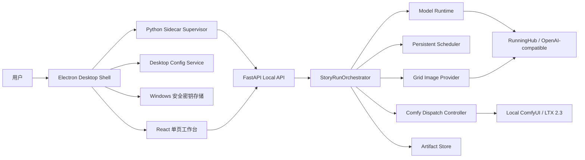
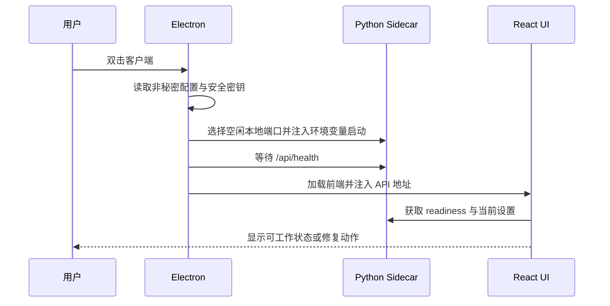

# Relief Story Agent 海滩自动制片工作台完整研发规格

> 文档状态：Draft / 待产品确认后进入实施计划
>
> 文档日期：2026-06-29
>
> GitHub 核对基线：`origin/master@0d5cd22`、PR #3、两处本地工作树
>
> 适用仓库：`D:\codex工作区`
>
> 主要交付单元：`frontend`、`relief_story_agent`、`desktop/electron`
>
> 参考方法：EGSS AgentOS Skill v2.2、现有项目代码、现有海滩版 UI、ComfyNexus 的桌面产品化思路

---

## 0. 先用白话说明这次到底要做什么

Relief Story Agent 不应继续被做成“很多配置页拼起来的后台管理系统”，也不应在新首页里嵌入一整套旧页面。它应该成为一个真正的一页式桌面制片工具：用户进入软件后，海滩背景始终清晰可感；中间只有一个足够简单的任务发起区；点击一次即可让系统完成从故事、剧本、导演分镜、提示词审查、四宫格参考图到 ComfyUI/LTX 2.3 排队生成的完整流程。

用户有内容时，可以粘贴灵感、创作要求或现有剧本；用户没有内容时，也可以选择任务数量后让系统自动起题。常用选项只保留时长、横竖屏、任务数量、创作预设和启动按钮。模型、API、工作流、提示词模板、重试、输出目录等配置都收入高级配置抽屉。

开始任务后，软件不跳转到旧 UI，而是在同一个海滩工作台中切换到“工作状态”。十道流程以厨房出餐为比喻展示：备料、慢炖、试味、配菜、调味、回锅、锁菜谱、出盘、打包、出餐中。每道流程必须显示真实后端状态，不使用演示数据。

现有后端不是废品。它已经具备十阶段骨架、持久化任务、批量调度、失败恢复、ComfyUI 接入、四宫格生成和产物导出等重要能力。此次升级的重点是：补齐少数后端契约缺口，建立配置与提示词的正式数据模型，然后让新 UI 完整接管现有后端能力。

---

## 1. Stage Decision Record

| 字段 | 决定 |
|---|---|
| 当前阶段 | 产品与系统规格设计 |
| 本阶段允许产物 | 需求账本、现状审计、目标架构、UI 规格、API 契约、Work Packet、验收矩阵 |
| 本阶段禁止事项 | 不实施业务代码；不替换当前 UI；不修改模型配置；不迁移用户数据 |
| 主产品方向 | 一页式海滩自动制片工作台 |
| 核心任务 | 一键或快捷批量创建任务，并持续观察十阶段自动流水线 |
| 旧 UI 处理 | 立即冻结视觉与页面扩展；仅复用底层契约/API，在全新工作台中重新实现业务能力，完成后删除旧产品路由 |
| 后端策略 | 保留现有管线与调度器，采用增量契约升级，不整体重写 |
| 桌面策略 | Electron 负责桌面生命周期、文件选择、配置、安全密钥和 Python sidecar |
| 发布策略 | 先做到本地 Windows 桌面端完整闭环，再考虑云端协同 |
| 当前阻塞决策 | 四宫格画布比例与 ComfyUI 工作流契约需在实施前确认 |

### 1.1 本文档的事实优先级

1. 用户在本轮提出的产品目标和流程要求。
2. `relief_story_agent` 当前后端代码所体现的真实行为。
3. `frontend` 和 `desktop/electron` 当前代码所体现的真实行为。
4. 现有研发文档中的未过期部分。
5. 视觉参考只能影响表达方式，不能覆盖产品真实流程。

### 1.2 不可破坏的产品原则

1. 用户不需要理解开发端口才能使用桌面软件。
2. 用户配置必须真正保存，并且运行时真正读取。
3. 所有按钮点击后必须立即反馈“正在做什么”。
4. 所有工作状态必须来自后端，不得使用静态演示数据冒充运行结果。
5. 创建任务后不得跳回旧 UI。
6. 海滩背景不是启动页装饰，工作状态下也必须保留明显存在感。
7. 高级配置不能污染首页，但也不能被做成不可编辑的展示面板。
8. 密钥不得写入 Git、普通配置 JSON、前端 localStorage 或界面明文。

---

## 2. Requirement Ledger

| ID | 用户需求 | 优先级 | 验收方式 |
|---|---|---:|---|
| R-001 | 一页式海滩背景桌面工作台 | P0 | 首页和运行态均保持海滩可见，不进入旧壳 |
| R-002 | 一键启动单条或批量自动任务 | P0 | 最少一次点击可创建默认任务；批量可设置数量 |
| R-003 | 支持灵感、创作要求、现有剧本和空白自动起题 | P0 | 四种输入模式分别通过真实任务测试 |
| R-004 | 自动执行十阶段流水线 | P0 | 后端时间线与 UI 十阶段逐项一致 |
| R-005 | 第 1 至第 6 阶段均具备可配置提示词模板 | P0 | 六个文本模板可编辑、校验、保存、恢复默认 |
| R-006 | 自动生成导演影视级运镜与 LTX 2.3 提示词 | P0 | 分镜结构包含镜头、机位、镜头运动和连续性字段 |
| R-007 | 自动生成 G2 四宫格参考图提示词和图片 | P0 | 生成提示词、图片产物、上传记录均可追溯 |
| R-008 | 自动审查并修正提示词漏洞 | P0 | 审查失败自动进入一次修正和一次复检 |
| R-009 | 自动把提示词与四宫格交给预设 ComfyUI 工作流 | P0 | 真实返回 prompt ID 并可查看队列/产物 |
| R-010 | 批量任务按队列稳定执行 | P0 | 任务可暂停、恢复、取消、重试；ComfyUI 不被并发冲垮 |
| R-011 | 高级参数放入按钮抽屉或小窗口 | P0 | 首页不直接展示端口和密钥字段 |
| R-012 | RunningHub 便捷模式与普通 OpenAI-compatible 模式分离 | P0 | 两种模式配置、模型清单和密钥状态互不混淆 |
| R-013 | RunningHub 国内站与国际站模型清单分离 | P0 | 切换站点后仅显示该站确认支持的精选模型 |
| R-014 | 横屏 16:9、竖屏 9:16，图片默认 2K | P0 | 请求、预检、产物元数据一致 |
| R-015 | UI 字体、层级和按钮反馈统一 | P0 | 视觉回归、可访问性与交互状态检查通过 |
| R-016 | 桌面客户端自己管理后端，不要求用户手动启动命令 | P0 | 双击客户端后后端自动就绪或给出可执行修复 |
| R-017 | 工作流支持拖拽和文件选择并真正保存 | P0 | 重启客户端后仍能读取保存路径并通过预检 |
| R-018 | 故事输入不能因预检而清空 | P0 | 预检成功、失败、切换抽屉后草稿均保留 |
| R-019 | 结果、日志、失败原因和恢复动作可见 | P1 | 运行详情可查看阶段输出、错误和推荐动作 |
| R-020 | 海滩视频、图片和音效离线可用 | P1 | 断网启动桌面客户端仍显示完整视觉背景 |

### 2.1 本轮明确不做

1. 不把产品扩展成通用 ComfyUI 工作流编辑器。
2. 不在首页暴露 Python、Vite、Electron 的开发端口。
3. 不把 RunningHub 云工作流假装成已经接入的本地 ComfyUI 替代项。
4. 不为追求视觉效果堆叠大量卡片、巨型标题和无功能装饰。
5. 不允许用户在运行中无限循环调用模型；所有自动修正必须有预算上限。
6. 不在本轮引入账号、多租户和远程协作系统。

---

## 3. 当前系统审计

### 3.1 总体判断

现有后端完成度高于现有前端完成度。GitHub `master` 已经具备可复用的十阶段业务骨架、持久化调度、恢复、ComfyUI、产物和基础桌面启动能力；但 RunningHub 便捷 LLM/G2、六阶段补充模板、2K 横竖屏等近期能力仍主要处于本地未提交状态，不能写成 GitHub 已交付。

现有 UI 无论是 GitHub `master` 的管理台式页面、WP-004 的 ComfyNexus/Moblinks 改版，还是当前未提交的海滩沉浸页，都不作为下一版视觉和页面结构的继承基础。它们只作为业务字段、API 调用和失败案例的参考。下一版前端采用全新信息架构和组件结构重新实现。

### 3.1.1 代码证据分层

本规格审计必须区分四个事实层，不能再把它们统称为“当前已有”：

| 层级 | 2026-06-29 状态 | 可作为何种证据 |
|---|---|---|
| GitHub `origin/master` | `0d5cd22`，已合并 PR #1、#2 | 已发布到主分支的事实基线 |
| GitHub PR #3 | `codex/wp-003-desktop-settings`，OPEN，merge state CLEAN，未配置 CI checks | 可审查但尚未合并的桌面设置能力 |
| 本地 WP-004 提交链 | 最新 `f6b783f`，没有对应远端分支 | 本地已提交实验，不是 GitHub 事实 |
| 当前主工作区未提交改动 | 包含 RunningHub 便捷 API、2K 比例、阶段模板、海滩页及另一套 Electron 文件 | 开发中的候选实现，必须测试、整理和分包后才能合并 |

GitHub 项目地址：`https://github.com/AharaOoO/relief-story-agent`。本规格后续使用以下状态词：

1. `master 已有`：已经存在于 `origin/master`。
2. `PR 已有`：只存在于远端未合并 PR。
3. `本地候选`：只存在于本地提交或未提交改动。
4. `目标待开发`：代码中尚无完整实现。

### 3.2 当前后端能力矩阵

| 能力 | 证据层 | 结论 |
|---|---|---|
| 十阶段规范顺序 | master 已有 | `CANONICAL_STAGE_ORDER` 与目标十阶段基本一致 |
| 单任务创建与持久化 | master 已有 | 可继续使用 |
| 批量任务创建 | master 已有 | 后端契约完整，前端尚未充分使用 defaults 和 failure policy |
| 后台调度与租约恢复 | master 已有 | `PersistentRunScheduler` 支持恢复、优先级和多 worker |
| 阶段失败分类与重试 | master 已有 | 可供新 UI 直接展示和触发 |
| Gemini 总编剧 | master 已有 | 当前提示词过度绑定“低刺激疗愈短片”，需预设化 |
| DeepSeek 改稿 | master 已有 | 可保留并扩展为质量门禁失败后的受控回炉 |
| 剧本质量门禁 | master 部分已有 | 当前仅硬规则校验，不调用 LLM，不满足目标要求 |
| GPT 分镜提示词 | master 已有 | 输出结构需加强导演、运镜和 LTX 2.3 字段 |
| GPT 提示词审查 | master 已有 | 已检查空间、轴线、运动和故事逻辑 |
| GPT 提示词修正 | master 已有 | 当前最多修正一次，但缺少修正后的再次审查闭环 |
| 最终提示词锁定 | master 已有 | 当前偏轻，需要形成明确 Prompt Package |
| 四宫格提示词编译 | master 已有 | 从四个代表镜头编译 2x2 contact sheet |
| OpenAI-compatible 生图 | master 已有 | 当前主分支的正式图片 provider |
| RunningHub 云工作流 API | master 已有 | 是独立 workflow API，不等于 Run Pipeline 的便捷 LLM/G2 模式 |
| RunningHub 便捷 LLM | 本地候选 | provider router 已在本地开发，尚未提交到 GitHub |
| RunningHub G2 生图 | 本地候选 | task submit/query/download 已在本地开发，尚未提交到 GitHub |
| 2K 与 16:9/9:16 配置 | 本地候选 | 本地模型已增加字段，尚未提交到 GitHub |
| 四宫格图片校验 | master 与本地均有冲突 | 校验器仍强制近似 1:1，与本地横竖屏候选配置冲突 |
| 六阶段补充模板路径 | 本地候选 | 本地允许 1-6 配置路径，但第 3 步仍不会调用 LLM |
| Prompt Profile 数据模型 | 目标待开发 | 当前候选实现仍只是机器本地模板文件路径 |
| ComfyUI 工作流分析 | master 已有 | 能识别 LTX 注入点和四宫格节点 |
| ComfyUI 队列提交 | master 已有 | 支持 prompt ID、等待、下载、取消和诊断 |
| ComfyUI 提交并发限制 | master 已有 | 默认 1，但需要更清晰的跨批次分发策略 |
| 产物写入与批量导出 | master 已有 | 可继续使用 |
| 运行时间线与事件 | master 已有 | 新前端应消费真实数据 |
| 配置热加载 | 目标待开发 | setup bundle 写出文件后，运行中的后端不会自动读取 |
| 安全密钥存储 | 本地 WP-004 候选 | 有本地开发痕迹，但未进入 GitHub 分支，仍需安全审计 |
| Python sidecar 基础生命周期 | master 部分已有 | Electron 已能启动、等待和退出后端，但仍使用固定端口且缺少完整监督 |

### 3.3 当前前端问题

1. GitHub `master` 仍是传统侧栏 + 多页面管理台，并包含 `sampleRun`、`sampleBatch`、`sampleReadiness` 等 fixtures；它不是目标 UI。
2. 本地 `ImmersiveWorkspacePage` 把创建页、批量页、产物页、设置页同时挂到一个超长页面中，导致一页式体验变成约数千像素的纵向拼接；该页面未进入 GitHub。
3. 本地海滩页创建成功后仍跳到 `/runs/:runId/review`，该路由位于旧 `AppShell`，因此会重新出现旧 UI。
4. 运行评审页、阶段时间线、四宫格预览、事件和批量详情仍混有静态演示数据。
5. `generation_mode`、横竖屏、ComfyUI endpoint 和 workflow path 在本地前端有控件，但转换后没有完整进入真实 `RunRequest`。
6. “导入剧本”只改变输入框提示，没有打开文件、读取内容或记录输入类型。
7. 批量页默认使用样例文本、样例 batch ID 和固定参数，没有成为真实生产入口。
8. 部分设置仅保存在 localStorage；后端进程既不知道，也不会自动重载。
9. 本地实验页面使用 `Impact`、`Trebuchet MS`、大量 900/950 字重和 `vw` 级字号，中文层级不稳定。
10. 本地海滩视频和音效引用网络 URL，打包后断网体验不可靠。
11. 现有三轮 UI 都存在页面职责混杂、卡片嵌套或视觉重点不清的问题，因此不再继续局部修补。

### 3.4 当前桌面壳问题

1. GitHub `master` 的 Electron 已实现开发环境 Python 启动、固定 8891 健康等待、窗口加载和退出时停止后端；这部分应保留。
2. 打包配置声明了 `sidecar/bin`，但 GitHub 中没有可复现的 sidecar 构建流水线和已验证二进制产物，不能视为打包闭环完成。
3. `master` 使用固定后端端口和固定开发前端端口，端口冲突处理不足。
4. `master` 将 sidecar stdio 丢弃，缺少可见启动失败、日志采集和崩溃原因。
5. `master` 不具备工作流、剧本和目录选择 IPC，也没有安全密钥存储。
6. PR #3 增加桌面设置、重启后端和打开日志目录，但仍未合并，而且 GitHub PR 没有 CI checks。
7. 当前工作区另有 `main.cjs/preload.cjs` 实验实现，它与 GitHub 的 `src/main.js/src/preload.js` 是两套入口，必须统一，不能同时保留。
8. 目标桌面端仍需补齐动态端口、受控日志、崩溃监督、安全密钥、文件选择、版本握手和可复现打包。

### 3.5 端口与用户认知

| 地址/端口 | 真实用途 | 是否应让普通用户配置 |
|---|---|---|
| `127.0.0.1:8891` | Relief Story Agent 本地 API | 否。桌面端自动分配和管理；仅开发诊断显示 |
| `127.0.0.1:8188` | 用户本地 ComfyUI | 是。放入高级配置并提供自动发现/检测 |
| `5173/5174` | Vite 开发预览端口 | 否。打包应用不存在此端口 |
| HTTPS 443 | RunningHub、Gemini、DeepSeek、OpenAI 等外部 API | 否。用户只选择供应商、站点和模型 |

---

## 4. 目标产品定义

### 4.1 产品定位

Relief Story Agent 是面向 AI 短剧制作者的本地桌面自动制片工具。它把创意输入、剧本生产、导演分镜、提示词工程、参考图生成、ComfyUI/LTX 2.3 队列和结果整理合并为一条可追踪、可恢复、可批量运行的生产线。

### 4.2 核心用户

1. 已有 ComfyUI 和 LTX 2.3 工作流，希望降低重复操作的个人创作者。
2. 需要一次创建多个短剧任务、批量排队并隔天查看结果的小型工作室。
3. 有剧本但不擅长导演运镜与提示词工程的内容创作者。
4. 没有完整剧本，只想用一句灵感快速试片的非技术用户。

### 4.3 核心价值顺序

1. 启动任务快。
2. 批量设置快。
3. 自动流程可信。
4. 出错可恢复。
5. 配置可理解。
6. 视觉舒适且有产品辨识度。

### 4.4 三层使用模式

| 层级 | 用户行为 | UI 暴露内容 |
|---|---|---|
| 一键模式 | 不填内容，选择数量后直接开始 | 数量、时长、横竖屏、预设、开始按钮 |
| 快捷模式 | 输入灵感、要求或剧本后开始 | 主输入框、输入类型识别、常用参数 |
| 专家模式 | 精调模型、六段提示词、工作流与执行策略 | 高级配置抽屉和验证对话框 |

---

## 5. 用户任务流

### 5.1 空白一键生成

1. 用户打开桌面客户端。
2. 软件自动完成本地后端、模型密钥状态和 ComfyUI 的轻量检查。
3. 用户不输入任何文字，选择“任务数 3”“横屏 16:9”“3-5 分钟”“悬疑短剧预设”。
4. 用户点击“一键开做 3 个任务”。
5. 系统为每个任务生成不同的创意种子，并进入十阶段流水线。
6. 首页原位切换为运行工作台，展示批次总体进度和每个任务状态。

### 5.2 灵感或创作要求

1. 用户输入一句灵感或一段要求。
2. 系统自动识别为 `idea` 或 `requirements`，用户可手动纠正。
3. Gemini 总编剧提炼内核、核心矛盾、人物与结构。
4. 后续阶段自动完成，用户可在运行态查看阶段产物。

### 5.3 导入已有剧本

1. 用户拖入或选择 `.txt`、`.md`、`.json` 或支持的剧本文档。
2. 桌面端读取文本并显示文件名、字数和解析状态。
3. 第 1 步切换为“剧本分析与内核锁定”，不得把已有剧本当作一句灵感重写。
4. 第 2 步在保留核心情节的前提下做结构、节奏与可拍摄性优化。

### 5.4 快捷批量设置

批量入口必须支持四种来源：

1. 自动起题：只填任务数量和共同预设。
2. 一行一个任务：粘贴多行灵感或要求。
3. 表格编辑：每行可设置标题、内容、时长、比例和优先级。
4. 文件导入：导入多个剧本文件，或导入 CSV/JSON 任务清单。

创建前展示“批次摘要”，而不是原始 JSON：有效任务数、预计模型调用数、预计 G2 图片数、ComfyUI 任务数、配置阻塞项和成本警告。

### 5.5 运行中操作

1. 查看十阶段总体状态。
2. 展开某阶段查看模型、尝试次数、耗时、输出摘要和错误。
3. 暂停整个批次，停止继续领取新任务。
4. 取消未开始任务；对已提交 ComfyUI 的任务显示远端取消结果。
5. 从失败阶段重试，不重复已成功且可复用的副作用。
6. 打开四宫格、最终提示词、视频或产物目录。

---

## 6. 十阶段流水线正式规格

### 6.1 宏观阶段表

| # | 烹饪标签 | 技术阶段 ID | 目标行为 | 模型/API | 关键产物 |
|---:|---|---|---|---|---|
| 1 | 备料 | `chief_screenwriter` | 按输入类型生成或分析故事，锁定内核、人物、矛盾和初稿 | LLM | `StoryCore`、`DraftScript` |
| 2 | 慢炖 | `deepseek_polish` | 优化结构、对白、节奏、可拍摄性和情绪推进 | LLM | `PolishedScript` |
| 3 | 试味 | `quality_gate` | LLM 剧本审查后再执行不可绕过的硬规则门禁 | LLM + 本地规则 | `ScriptQualityReport` |
| 4 | 配菜 | `gpt_prompt_writer` | 生成导演级分镜、LTX 2.3 提示词和四宫格分镜素材 | LLM | `StoryboardPackage` |
| 5 | 调味 | `gpt_prompt_audit` | 审查轴线、空间、动作、镜头、人物、静态图与视频逻辑 | LLM | `PromptAuditReport` |
| 6 | 回锅 | `gpt_prompt_reviser` | 按审查意见修正一次，并触发一次复检 | LLM | `RevisedStoryboardPackage` |
| 7 | 锁菜谱 | `final_prompts` | 校验并冻结可复现的最终提示词包 | 本地校验 | `FinalPromptPackage` |
| 8 | 出盘 | `four_grid_asset` | 调用 G2 或兼容图像模型生成 2K 四宫格，并上传 ComfyUI | 图像 API | `FourGridAsset` |
| 9 | 打包 | `artifacts` | 写入剧本、审查、提示词、图片、manifest 和追踪信息 | 文件系统 | `ArtifactManifest` |
| 10 | 出餐中 | `comfyui` | 将每个镜头的提示词与参考图注入预设 LTX 2.3 工作流并排队 | ComfyUI API | `PromptIds`、`VideoOutputs` |

### 6.2 第 1 步：备料

输入模式必须改变总编剧行为：

| 输入模式 | 总编剧职责 |
|---|---|
| `auto` | 自主生成题材、人物、矛盾、内核和初稿；同一批次避免重复设定 |
| `idea` | 扩展一句灵感，不曲解用户给定的核心意象 |
| `requirements` | 把题材、受众、禁忌、时长和风格转成故事方案 |
| `script` | 分析已有剧本、提炼内核和问题，保留核心情节 |
| `mixed` | 以剧本为主体，用额外要求约束优化方向 |

当前硬编码的“压力人群、低刺激、60-120 秒、五段式结构”应迁移为内置的“疗愈短片”预设，不再成为所有项目的唯一规则。

### 6.3 第 2 步：慢炖

DeepSeek 改稿必须输出：

1. 完整改稿剧本。
2. 与原稿的修改摘要。
3. 核心句是否保持。
4. 结构、对白、人物动机、节奏和可拍摄性自检。
5. 如果第 3 步失败，接收质量报告并进行一次受控回炉。

### 6.4 第 3 步：试味

目标实现采用“双层门禁”：

1. LLM 质量审查：评估主题内核、矛盾成立、人物动机、因果、节奏、对白、可拍摄性、时长和风格一致性。
2. 本地硬规则：验证 JSON 契约、必要字段、时长范围、禁用项、关键节拍和核心句。

处理规则：

1. 两层都通过，进入第 4 步。
2. 发现可修复问题，带着结构化报告回到第 2 步一次，然后重新执行第 3 步。
3. 第二次仍失败，任务停止为 `awaiting_input` 或 `failed`，不得无限循环。
4. UI 在第 2、3 步显示“第 1/2 轮”。

### 6.5 第 4 步：配菜

每个镜头至少包含：

1. `shot_id`、场次、时间、地点和持续时间。
2. 景别、机位高度、拍摄角度、镜头焦段或视觉等效描述。
3. 运镜类型、起始构图、结束构图、运动速度和稳定方式。
4. 人物站位、动作分解、视线、屏幕方向和轴线侧。
5. 前景、中景、背景和场景地理关系。
6. 光线、色温、天气、材质和美术连续性。
7. `ltx_video_prompt`、`g2_image_prompt`、`negative_prompt`。
8. ComfyUI 输入：positive、negative、seed、strength、filename prefix。
9. 与上一个镜头的动作接续和与下一个镜头的出点。

### 6.6 第 5、6 步：调味与回锅

审查维度必须覆盖：

1. 人物身份、服装、道具和场景连续性。
2. 180 度轴线、屏幕方向和视线匹配。
3. 动作是否能从前一镜接到后一镜。
4. 运镜是否和人物动作冲突。
5. 静态 G2 图片提示词是否混入无法表达的长时间动作。
6. LTX 视频提示词是否缺少时间顺序和运动信息。
7. 四宫格四帧能否覆盖故事前、中、转折、结果。
8. 负面提示词是否会误伤主体。
9. 时长、镜头数和总节奏是否匹配。

自动策略：

1. 首次审查通过：第 6 步显示“无需回锅”，状态为 `skipped`，不浪费一次模型调用。
2. 首次审查失败：进入第 6 步修正一次。
3. 修正完成：自动再执行一次第 5 步复检，但 UI 仍保持十个宏观阶段，不新增第 11 行。
4. 复检仍有严重问题：停止自动前进并给出可编辑建议。

### 6.7 第 7 至第 10 步

第 7 步将最终提示词、审查报告、模型版本、模板版本、比例、时长和随机种子冻结为快照。后续重试第 8 至第 10 步时不得因为全局配置变化而偷偷改写已经锁定的提示词。

第 8 步完成图片生成、格式校验、四象限有效性校验、文件落盘、哈希计算和 ComfyUI 上传。

第 9 步写入原始输入、剧本版本、质量报告、分镜、最终提示词、图片、模型使用量、失败记录和 manifest。

第 10 步由专用分发器向 ComfyUI 排队。默认允许前面的 LLM 任务并行准备，但 ComfyUI 提交与出图/出片队列采用受控并发，默认并发 1，避免多个批次同时冲击显存。

---

## 7. 一页式海滩工作台信息架构

### 7.1 结构原则

“一页式”指一个持续存在的工作壳和上下文，而不是把所有旧页面纵向堆在同一 HTML 页面。主界面只维护一个活动工作区；配置、详情、日志、模板和文件选择通过抽屉、对话框或局部面板出现。

### 7.2 顶层区域

| 区域 | 常驻内容 | 说明 |
|---|---|---|
| 顶部状态栏 | 产品名、后端状态、ComfyUI 状态、当前供应商、设置按钮 | 高 52-60px，不放开发术语 |
| 海滩氛围层 | 本地视频或高质量静态图、可选海浪音、低动态模式 | 始终全屏存在 |
| 主工作区 | 发起态、运行态、完成态三者之一 | 不同时挂载旧页面 |
| 批次托盘 | 当前批次任务列表和总进度 | 运行批量任务时出现，可折叠 |
| 通知区 | 操作反馈、错误、恢复动作 | Toast + 就地状态，不遮挡主任务 |

### 7.3 三种主工作态

#### A. 发起态

首屏只展示：

1. 简短产品标题，例如“今天想做几条短剧？”
2. 一个主输入框，可留空。
3. 输入类型：自动、灵感/要求、已有剧本。
4. 任务数量步进器。
5. 时长选择。
6. 横屏/竖屏分段控件。
7. 创作预设选择。
8. “一键开做”主按钮。
9. “高级配置”图标按钮。

#### B. 运行态

1. 发起区收拢为顶部运行摘要条，不消失。
2. 中央展示十阶段流水线。
3. 右侧或底部展示批次任务托盘，取决于窗口宽度。
4. 当前阶段展开，其他阶段保持紧凑。
5. 海滩至少在窗口上部、两侧和阶段间隙中清楚可见。
6. 用户可继续添加任务，新任务进入同一队列或新批次。

#### C. 完成态

1. 展示完成数量、失败数量、总耗时和输出目录。
2. 直接显示代表性四宫格和视频缩略图。
3. 提供“打开产物”“再次生成”“只重做视频”“导出制作包”。
4. 十阶段仍可展开查看证据。

### 7.4 不再保留的交互

1. 不再从新首页跳转到旧 `AppShell`。
2. 不再同时在 DOM 中挂载创建、批量、产物和设置四个完整页面。
3. 不再使用演示 batch ID 或静态运行时间线。
4. 不再让普通用户输入后端 API 地址。
5. 不再用原始 JSON 作为默认诊断呈现；JSON 只放在“技术详情”。

### 7.5 UI 全量重做边界

本项目的“重新做 UI”不是继续改 `index.css`，也不是给旧页面换颜色。实施时执行以下边界：

#### 可以复用

1. 已验证的 API client、query key、错误规范化和 TypeScript contract。
2. 后端 readiness、run、batch、timeline、artifact、recovery 的真实接口。
3. 无视觉负担的底层工具函数和格式化函数。
4. 经检查后仍满足新契约的可访问性基础组件。

#### 不继承

1. `AppShell`、旧 Sidebar、旧 Topbar 和旧页面导航结构。
2. `ImmersiveWorkspacePage` 把完整旧页面拼成长页的实现方式。
3. 旧首页、旧设置页、旧批量页、旧评审页的布局和视觉层级。
4. `sampleRun`、`sampleBatch`、`sampleReadiness` 等生产运行时 fixtures。
5. 当前巨型标题、异常字重、卡片套卡片和网络海滩资源。
6. `main.cjs` 与 `src/main.js` 两套桌面入口并存的状态。

#### 新前端模块边界

```text
frontend/src/app/workbench/           单一海滩工作壳与三种主状态
frontend/src/features/task-launcher/  单条、空白自动、剧本导入、批量创建
frontend/src/features/run-pipeline/   十阶段真实运行状态与阶段详情
frontend/src/features/batch-tray/     批次队列、筛选、暂停、恢复、重试
frontend/src/features/result-dock/    四宫格、视频、产物与导出
frontend/src/features/settings/       高级配置、Prompt Profile、验证与保存
frontend/src/shared/desktop/          受类型约束的 Electron bridge
frontend/src/shared/api/              复用并升级真实 API client
```

旧 UI 在新工作台达到功能等价前进入 freeze：只修复阻断性缺陷，不再增加样式和新业务入口。新工作台完成真实单任务、真实批量、恢复和产物闭环后，一次性移除旧产品路由，避免两套 UI 长期共存。

---

## 8. 首页与批量任务详细设计

### 8.1 主输入框

输入框支持：

1. 粘贴一句灵感。
2. 粘贴创作要求。
3. 粘贴完整剧本。
4. 拖入一个剧本文件。
5. 留空自动创作。

输入框下方实时显示识别结果，例如“已识别：现有剧本，约 4 分钟”。识别只是建议，用户可以切换输入类型。

草稿保存规则：

1. 输入变化后 500ms 写入桌面配置草稿区。
2. 预检、打开抽屉、切换比例和创建失败都不得清空草稿。
3. 创建成功后询问保留或清空；默认保留到用户明确开始新任务。

### 8.2 批量快捷区

任务数量使用步进器，默认 1，可选择 1-20。数量大于 1 时，主按钮文案变为“一键开做 N 个任务”。

批量编辑按钮打开一个中等宽度对话框，展示可编辑表格：

| 列 | 必填 | 默认来源 |
|---|---|---|
| 启用 | 是 | true |
| 任务名 | 否 | 自动生成 |
| 输入类型 | 是 | 自动识别 |
| 内容 | 视模式 | 用户输入或自动起题 |
| 时长 | 是 | 批次默认值 |
| 比例 | 是 | 批次默认值 |
| 预设 | 是 | 批次默认值 |
| 优先级 | 否 | 0 |

### 8.3 创建前检查

点击开始后先进入不超过数秒的轻量预检：

1. 后端在线。
2. 所需模型 profile 有密钥。
3. Prompt Profile 存在且可解析。
4. G2 图像配置存在。
5. ComfyUI endpoint 可达。
6. 工作流可读且注入点完整。
7. 输出目录可写。

预检通过后立即创建任务。预检未通过时不清空输入，弹出人话错误和直接修复按钮，例如“选择工作流”“保存 RunningHub key”“重新检测 ComfyUI”。

### 8.4 按钮反馈标准

每个异步按钮必须具备：

1. 点击瞬间进入 loading。
2. 按钮文案变成具体动作，如“正在检查 ComfyUI”。
3. 避免重复点击。
4. 结果在按钮附近显示。
5. 超过 8 秒显示已执行时间和“查看详情”。
6. 失败显示原因、建议动作和重试，不只显示英文异常。
7. 屏幕阅读器通过 `aria-live` 收到状态变化。

---

## 9. 十阶段运行工作台 UI

### 9.1 每行结构

每个阶段行固定包含：

1. 阶段序号圆标。
2. 烹饪标签与技术说明，例如“备料 · Gemini 总编剧”。
3. 状态文字。
4. 进度轨道。
5. 当前模型或执行器。
6. 耗时。
7. 展开按钮。

### 9.2 状态词典

| 状态 | 中文展示 | 视觉 |
|---|---|---|
| `waiting` | 待命 | 中性灰 |
| `queued` | 已排队 | 海蓝 |
| `running` | 处理中 | 琥珀色进度与轻量动画 |
| `retrying` | 正在重试 | 珊瑚色，显示第几次 |
| `awaiting_input` | 需要处理 | 高对比警告 |
| `completed` | 已完成 | 绿色勾选 |
| `skipped` | 无需执行 | 淡蓝，说明原因 |
| `failed` | 失败 | 红色与修复按钮 |
| `cancelled` | 已取消 | 中性删除线或图标 |

### 9.3 展开详情

模型阶段展示：模型名、provider、模板版本、请求次数、token、成本估算、输出摘要和完整产物入口。

门禁阶段展示：评分、严重问题、建议、硬规则结果和是否发生回炉。

G2 阶段展示：提示词摘要、比例、分辨率、图片预览、provider 任务 ID 和重试。

ComfyUI 阶段展示：工作流名称、队列序号、prompt ID、预计镜头数、完成镜头数、失败镜头和输出文件。

### 9.4 批次托盘

批次托盘每行显示任务名、当前烹饪阶段、总进度、状态和快捷动作。默认只展开当前任务，列表超过 20 条时虚拟滚动。

---

## 10. 海滩视觉与设计系统

### 10.1 视觉方向

视觉主题命名为“Coastal Production Kitchen / 海岸制片厨房”。它应兼具海滩的松弛感和专业工具的可靠感。海滩是持续环境，不是盖在业务信息后面的模糊壁纸。

### 10.2 背景规则

1. 使用本地打包的海滩视频和静态 poster，不依赖远程 hotlink。
2. 背景主体包含清晰海平线、海水和沙滩，避免纯氛围模糊图。
3. 工作态主面板使用半透明实色表面，不使用大面积渐变。
4. 在 1280x800 窗口中，背景直接可见面积不低于约 30%。
5. 页面两侧和顶部保留可识别海景，不能被全宽不透明面板完全覆盖。
6. 低动态模式暂停视频，保留清晰静态图。
7. 海浪和环境声默认关闭，用户主动开启后记忆设置。

### 10.3 色彩令牌

| Token | 建议值 | 用途 |
|---|---|---|
| `--ink-strong` | `#17252D` | 主文字 |
| `--ink-soft` | `#4D5D63` | 次文字 |
| `--foam` | `#F6FAF8` | 高亮表面 |
| `--surface-work` | `rgba(246,250,248,0.88)` | 主工作面 |
| `--ocean` | `#0B6472` | 品牌主色、链接和选中态 |
| `--deep-sea` | `#163F52` | 深色按钮和标题 |
| `--sun` | `#F5B800` | 主操作、当前阶段 |
| `--coral` | `#E86C5D` | 警告和重试 |
| `--success` | `#2F9D68` | 完成状态 |
| `--danger` | `#C7443E` | 失败和取消 |
| `--line` | `rgba(23,37,45,0.16)` | 分隔线 |

沙滩米色只来自真实背景和少量中性表面，不允许整个 UI 被米黄、棕色或单一蓝色统治。

### 10.4 字体系统

字体栈：`"Segoe UI Variable", "Microsoft YaHei UI", "Segoe UI", sans-serif`。

| 层级 | 字号 | 字重 | 用途 |
|---|---:|---:|---|
| 产品标题 | 36-40px | 700 | 仅发起态主标题 |
| 页面/运行标题 | 28-32px | 700 | 当前任务或批次 |
| 区域标题 | 20-24px | 600 | 流水线、结果、设置 |
| 行标题 | 15-17px | 600 | 十阶段和任务行 |
| 正文 | 14px | 400/500 | 说明和内容 |
| 辅助信息 | 12px | 400/500 | 时间、模型、状态 |

禁止使用 `Impact` 作为中文主字体，禁止 750/850/950 等非标准字重，禁止用 viewport width 直接缩放正文。全局 `letter-spacing: 0`。

### 10.5 布局与组件

1. 主工作区最大宽度约 1180px。
2. 区域之间用留白、分隔线和标题组织，不把每个区域都做成悬浮卡片。
3. 卡片只用于任务列表项、结果缩略图和真正需要边界的重复对象。
4. 不允许卡片套卡片。
5. 图标按钮使用 Lucide，并提供 tooltip 和可访问名称。
6. 圆角控制在 6-8px；胶囊形状只用于状态、分段控件和短标签。
7. 固定格式控件必须有稳定尺寸，状态变化不得推动布局跳动。

---

## 11. 高级配置抽屉

### 11.1 抽屉结构

高级配置使用右侧抽屉，宽度约 520-640px。仅当编辑六段长提示词时，升级为大号对话框。抽屉包含以下分组：

1. 模型来源。
2. 六阶段模型绑定。
3. 六阶段提示词预设。
4. G2 四宫格。
5. ComfyUI 与工作流。
6. 执行与重试。
7. 输出与存储。
8. 诊断与日志。

抽屉底部固定显示“取消”“验证并保存”。保存时显示逐项进度，不允许无反馈。

### 11.2 模型来源：两个独立维度

#### 维度 A：LLM 与图像供应商模式

1. RunningHub 便捷 API。
2. 普通 OpenAI-compatible provider。

#### 维度 B：视频渲染后端

1. 本地 ComfyUI/LTX 2.3。
2. RunningHub 云工作流，只有真正接入完整 Run Pipeline 后才显示为可选。

不得再用一个 `generation_mode` 同时混合这两个概念。

### 11.3 RunningHub 模式

站点切换：

1. 国内站 `.cn`。
2. 国际站 `.ai`。

每个站点只展示产品确认过的精选模型。模型清单由版本化常量或后端 capability endpoint 提供，不把网站上的所有模型堆给用户。国内站和国际站分别维护，不能共用一张无条件清单。

推荐的 UI 绑定方式：

| 阶段 | 默认角色 | 可选模型来源 |
|---|---|---|
| 1 备料 | 总编剧 | 站点内精选 Gemini/通用创作模型 |
| 2 慢炖 | 改稿 | 站点内精选 DeepSeek/通用推理模型 |
| 3 试味 | 剧本审查 | 默认 DeepSeek，也可选高可靠审查模型 |
| 4 配菜 | 导演分镜 | 站点内精选 GPT/Gemini 强指令模型 |
| 5 调味 | 提示词审查 | 默认 GPT 高可靠模型 |
| 6 回锅 | 提示词修正 | 默认 GPT 轻量或同审查模型 |
| 8 出盘 | G2 生图 | `rhart-image-g-2` 或确认兼容的图像 endpoint |

RunningHub 同一站点共用一个 `RUNNINGHUB_API_KEY`。站点切换必须同步切换 base URL，并校验 key 是否属于对应站点。

### 11.4 普通 OpenAI-compatible 模式

分别配置 Gemini、DeepSeek、OpenAI/兼容模型的 base URL、model 和密钥引用。UI 提供连接测试，但不展示已保存密钥明文。

### 11.5 Prompt Profile

六阶段提示词不再只保存文件路径，而是形成正式的 Prompt Profile：

```text
PromptProfile
  id
  name
  description
  version
  created_at
  updated_at
  stages[1..6]
  source
  content_hash
```

每个阶段模板包含：

1. 不可删除的基础系统指令。
2. 用户可编辑的补充指令。
3. 必需输出契约说明。
4. 可用变量列表。
5. 预览和校验结果。

必须支持：新建、复制、重命名、编辑、恢复默认、导入、导出、设为默认。运行创建时保存 profile ID、版本、内容哈希和实际模板快照，保证未来可复现。

### 11.6 六段提示词编辑体验

1. 使用六个标签页或左侧阶段列表，不把六个长文本框同时堆在抽屉中。
2. 显示默认模板与用户补充区，普通用户优先编辑补充区。
3. 显示字符数、预计 token、缺失变量和 JSON 输出契约错误。
4. 提供“试运行当前阶段”，但必须明确会产生模型费用。
5. 提供“仅本次任务覆盖”，不修改全局 profile。

### 11.7 ComfyUI 配置

普通用户可编辑：

1. ComfyUI 地址，默认 `http://127.0.0.1:8188`。
2. 工作流 JSON 路径，支持拖拽、选择、最近使用。
3. 输出等待策略。
4. 输出目录。

系统自动显示：连接状态、队列数量、工作流格式、节点数、缺失节点、LTX 注入点和四宫格需求。连接与工作流分析必须是两个可区分的检查结果。

---

## 12. 目标系统架构



### 12.1 职责边界

| 层 | 职责 | 禁止承担 |
|---|---|---|
| React | 用户输入、状态呈现、调用 API、可访问性交互 | 不保存明文密钥；不直接读任意本地文件 |
| Electron | 窗口、文件系统对话框、sidecar、凭据、安全 IPC | 不实现故事流水线业务逻辑 |
| FastAPI | 契约、校验、任务控制、事件和诊断 | 不管理窗口 |
| Orchestrator | 十阶段、循环预算、恢复、幂等副作用 | 不关心视觉状态 |
| Model Runtime | provider 适配、重试、usage、结构化输出 | 不决定产品页面流程 |
| Comfy Dispatcher | 顺序提交、队列背压、取消、产物刷新 | 不修改最终提示词 |

---

## 13. 数据契约升级

### 13.1 StoryInputSpec

```json
{
  "mode": "auto | idea | requirements | script | mixed",
  "content": "用户文字或解析后的剧本文本",
  "source_name": "可选文件名",
  "language": "zh-CN",
  "preserve_original_plot": true
}
```

### 13.2 CreationSpec

```json
{
  "duration_seconds": 240,
  "video_aspect_ratio": "16:9",
  "image_resolution": "2k",
  "style_preset_id": "cinematic_suspense",
  "series_name": "",
  "audience": "",
  "creative_constraints": []
}
```

### 13.3 PromptProfileBinding

```json
{
  "profile_id": "prompt_profile_default",
  "profile_version": 3,
  "stage_overrides": {
    "chief_screenwriter": "",
    "deepseek_polish": "",
    "quality_gate": "",
    "gpt_prompt_writer": "",
    "gpt_prompt_audit": "",
    "gpt_prompt_reviser": ""
  }
}
```

### 13.4 RunRequest V2

`RunRequest V2` 应增加 `input_spec`、`creation_spec`、`prompt_profile` 和明确的 `render_backend`。迁移期继续接受旧 `idea` 字段，并将其转换成 `input_spec.mode=idea`。

关键规则：

1. `auto` 模式允许 content 为空。
2. 横竖屏必须进入 `ComfyUIRunConfig.grid_image.aspect_ratio` 和最终提示词上下文。
3. 工作流路径和 endpoint 必须进入真实请求，而不是停留在 Zustand。
4. 批量 defaults 应包含公共 creation、prompt、model 和 ComfyUI 配置。
5. 每个 run 在创建时保存有效配置快照，不依赖之后的全局配置。

### 13.5 ScriptQualityReport

至少包含：

1. `passed`。
2. 总分与各维度分数。
3. `critical_issues`、`major_issues`、`minor_issues`。
4. 每个问题对应场景、证据和修改建议。
5. `deterministic_checks`。
6. `revision_required`。
7. `revision_round`。

### 13.6 FinalPromptPackage

至少包含：

1. 最终分镜数组。
2. 每镜 LTX 2.3 prompt。
3. 每镜 G2 静态 prompt。
4. 四宫格组合 prompt。
5. 负面提示词。
6. 比例、分辨率、时长、seed 和 ComfyUI inputs。
7. 审查和复检摘要。
8. 模型、模板和配置快照哈希。

---

## 14. API 与前端映射

### 14.1 已有 API 应直接复用

| UI 能力 | 已有 API |
|---|---|
| 顶部后端状态 | `GET /api/health` |
| 本地就绪情况 | `GET /api/local/readiness` |
| 模型配置状态 | `GET /api/config/models` |
| 模型连接测试 | `POST /api/config/model-check` |
| 十阶段定义 | `GET /api/pipeline/schema` |
| 单任务预检 | `POST /api/config/validate` |
| 单任务诊断 | `POST /api/config/diagnose` |
| 创建单任务 | `POST /api/runs` |
| 任务列表/详情 | `GET /api/runs`、`GET /api/runs/{id}` |
| 真实事件 | `GET /api/runs/{id}/events` |
| 真实时间线 | `GET /api/runs/{id}/timeline` |
| 阶段审计 | `GET /api/runs/{id}/audit` |
| 任务产物 | `GET /api/runs/{id}/artifacts` |
| 批次预检 | `POST /api/config/validate-batch` |
| 批次计划 | `POST /api/batches/plan` |
| 创建批次 | `POST /api/batches` |
| 批次列表/详情 | `GET /api/batches`、`GET /api/batches/{id}` |
| 批次时间线 | `GET /api/batches/{id}/timeline` |
| 批次控制 | pause/resume/cancel/retry endpoints |
| ComfyUI 检查 | `POST /api/comfyui/connect` |
| 工作流分析 | `POST /api/comfyui/analyze-workflow` |
| 工作流发现 | `POST /api/comfyui/discover-workflows` |
| 输出刷新 | `POST /api/runs/{id}/refresh-comfyui` |

### 14.2 建议新增 API

| API | 用途 |
|---|---|
| `GET /api/settings/runtime` | 返回已生效的非秘密配置和版本 |
| `PUT /api/settings/runtime` | 原子保存并热应用可热加载配置 |
| `POST /api/settings/runtime/validate` | 保存前验证 |
| `GET /api/prompt-profiles` | 列出 Prompt Profile |
| `POST /api/prompt-profiles` | 新建 profile |
| `GET /api/prompt-profiles/{id}` | 读取 profile |
| `PUT /api/prompt-profiles/{id}` | 更新并递增版本 |
| `POST /api/prompt-profiles/{id}/validate` | 校验六阶段模板 |
| `POST /api/prompt-profiles/{id}/clone` | 克隆 profile |
| `POST /api/prompt-profiles/{id}/reset` | 恢复内置默认 |
| `GET /api/capabilities/models` | 返回当前 provider/站点的精选模型能力 |
| `GET /api/runs/{id}/stream` | 可选 SSE，减少高频轮询 |
| `GET /api/batches/{id}/stream` | 可选 SSE，实时批次状态 |
| `POST /api/inputs/inspect` | 识别灵感、要求或剧本并返回摘要 |

### 14.3 API 响应规范

所有新接口统一返回：

```json
{
  "ok": true,
  "data": {},
  "error": null,
  "request_id": "req_xxx"
}
```

错误必须包含稳定的 `code`、用户可读 `message`、技术 `details`、是否可重试和推荐动作。前端默认显示 message 和动作，技术 details 放入可展开区域。

---

## 15. 桌面客户端运行时

### 15.1 启动流程



### 15.2 后端端口策略

开发环境可继续使用 8891。打包桌面端应由 Electron 选择可用 loopback 端口，并通过 preload 注入给前端。普通用户不看到也不编辑该端口。

### 15.3 必需 IPC

1. `selectScriptFiles`。
2. `selectWorkflowFile`。
3. `selectDirectory`。
4. `revealPath`。
5. `openLogsDirectory`。
6. `getRuntimeStatus`。
7. `restartBackend`。
8. `getSecretStatus`。
9. `saveSecret`。
10. `deleteSecret`。
11. `readDesktopConfig`。
12. `writeDesktopConfig`。

所有 IPC 都要限定允许的参数和路径类型，不向 renderer 暴露 Node.js。

### 15.4 密钥存储

优先使用 Electron `safeStorage` 或可靠的 Windows Credential Manager 集成。配置文件只记录密钥名称与“已配置”状态。启动 sidecar 时由 Electron 把所需密钥注入子进程环境变量，日志必须脱敏。

### 15.5 Sidecar 打包

建议将 Python 后端构建为独立可执行 sidecar，由 Electron Builder 作为 extraResource 打包。sidecar 必须包含版本信息、健康检查、受控退出和崩溃日志。客户端退出时优雅停止后端；异常退出时最多自动重启一次并向用户显示状态。

---

## 16. 配置、保存与生效模型

### 16.1 配置分层

| 层级 | 内容 | 保存位置 |
|---|---|---|
| 桌面全局设置 | 站点、模型绑定、ComfyUI、目录、默认预设 | Electron appData JSON，原子写入 |
| 安全密钥 | RunningHub/OpenAI/Gemini/DeepSeek key | Windows 安全存储 |
| Prompt Profile | 六阶段模板与版本 | appData 或后端专用 profile store |
| 当前草稿 | 输入文字、批量编辑、临时覆盖 | appData draft store |
| Run Snapshot | 本次任务全部有效配置 | 持久化 RunState/产物目录 |

### 16.2 生效规则

1. 可热加载项保存后由后端立即确认新版本。
2. 需要重启的项由 Electron 自动重启 sidecar，并等待健康检查。
3. UI 只有收到后端确认后才显示“已保存并生效”。
4. 仅写出 setup bundle 不等于生效，不能再用这种方式欺骗用户。
5. 每次保存返回生效版本号，任务保存所使用的版本号。

---

## 17. 四宫格比例决策

### 17.1 当前冲突

当前 `GridImageConfig` 支持 16:9、9:16 和 1:1，并默认 2K；但 `validate_grid_image` 强制图片接近正方形。这会造成 UI 选择横屏或竖屏后，G2 成功返回的图片被本地校验拒绝。

### 17.2 推荐方案

推荐将“视频比例”和“四宫格画布比例”拆为两个字段，但默认联动：

1. 视频比例：16:9 或 9:16。
2. 四宫格画布：默认跟随视频比例，2K。
3. 四格布局：画布内部 2x2 等分。
4. 校验器按所选画布比例验证，不再强制 1:1。
5. 每个格子的 prompt 强化主体构图和安全边距，接受单格本身不是完整视频比例这一事实。

备选方案是分别生成四张目标比例图片再本地拼成 2x2，但会产生约四倍图片调用和更复杂的一致性问题，不建议作为默认。

### 17.3 实施前必须实测

产品要求已经确认：G2 与 GPT Image 生图默认 2K、默认 16:9，并允许用户切换 9:16。实施时需要用真实 RunningHub 国内站与国际站 G2 调用各完成一次 16:9 2K 和 9:16 2K 测试，确认请求字段、响应轮询、下载 URL 和图片尺寸，然后冻结 provider contract。

---

## 18. 队列、并发与成本控制

### 18.1 默认策略

1. 后端最多并行准备 2 个 run 的 LLM 阶段。
2. G2 图片生成默认并发 1 或 2，可按 provider 限流调整。
3. ComfyUI 分发并发固定为 1。
4. 每个批次可设置最大在途任务数，防止一次把几百个任务灌入外部服务。
5. UI 显示“准备中”和“ComfyUI 排队中”的区别。

### 18.2 模型预算

每个任务默认预算：

1. 总编剧最多 2 次。
2. 改稿最多 2 次。
3. 剧本审查最多 2 次。
4. 分镜生成最多 2 次。
5. 提示词审查最多 2 次。
6. 提示词修正最多 1 次。
7. G2 图片最多 3 次。
8. ComfyUI 提交最多 3 次，但必须保持幂等。

创建批次前显示预计调用上限，不承诺精确费用；运行中累计真实 token、请求次数和已知价格估算。

---

## 19. 失败处理与恢复

| 场景 | 用户看到 | 系统动作 |
|---|---|---|
| 密钥缺失 | “RunningHub 密钥未配置” | 打开密钥设置并定位字段 |
| 模型 401 | “密钥无效或站点不匹配” | 不自动重试；建议重新保存 |
| 模型 429 | “服务限流，正在等待” | 指数退避并显示倒计时 |
| 模型输出 JSON 错误 | “模型输出格式不完整” | 在预算内重试并附加强约束 |
| 剧本质量失败 | 显示问题与回炉轮次 | 自动回第 2 步一次 |
| 提示词审查失败 | 显示漏洞数量 | 自动第 6 步修正一次并复检 |
| G2 任务失败 | 显示 provider task ID 和错误 | 可仅重试第 8 步 |
| G2 图片比例不符 | 显示实际/期望尺寸 | 不进入 ComfyUI；允许重试或手动替换 |
| ComfyUI 不可达 | “ComfyUI 未连接” | 保留前 9 步产物，等待恢复后重试第 10 步 |
| ComfyUI 节点缺失 | 显示缺失节点类型 | 不提交工作流；打开工作流诊断 |
| 客户端关闭 | 下次启动显示恢复中的任务 | 调度器按租约恢复 |
| sidecar 崩溃 | 顶栏显示后端重启中 | Electron 自动重启一次并保留日志 |

---

## 20. 非功能要求

### 20.1 性能

1. 桌面壳出现到静态 UI 可见不超过 2 秒为目标。
2. 后端健康检查在正常机器上 5 秒内完成。
3. 主工作区不挂载不可见旧页面。
4. 批次列表超过 100 条时使用分页或虚拟滚动。
5. 事件轮询采用增量 sequence；若实现 SSE，断线自动续传。

### 20.2 可访问性

1. 所有操作可键盘完成。
2. 焦点不会被抽屉和对话框丢失。
3. 状态不只依赖颜色。
4. 文本与背景对比达到 WCAG AA。
5. 支持 `prefers-reduced-motion`。
6. 音效默认关闭。

### 20.3 可观测性

1. 每次 UI 请求有 request ID。
2. 每次模型尝试有 attempt ID。
3. 每个外部任务记录 provider task ID 或 ComfyUI prompt ID。
4. 日志自动脱敏。
5. 一键生成诊断包，排除密钥和用户私密正文，或在导出前明确告知包含内容。

### 20.4 离线与网络降级

断网时桌面 UI、海滩资源、已有任务和本地产物库仍可打开。需要外部模型的动作显示“等待网络”，而不是白屏或无限 loading。

---

## 21. 迁移策略

### 21.1 不重写原则

保留以下后端资产：

1. `StoryRunOrchestrator` 的大部分阶段实现。
2. `PersistentRunScheduler`。
3. Run/Batch 持久化。
4. 失败分类、恢复、审计和产物体系。
5. ComfyUI 分析、注入、提交、取消和下载。
6. OpenAI-compatible provider 与现有 RunningHub 云工作流适配。

本地 RunningHub 便捷 LLM/G2 候选代码不直接视为可保留资产。它必须先从当前混杂工作区中拆成独立 Work Packet，补齐真实站点测试、错误契约和安全审查，再决定合并。

重点重构以下边界：

1. RunRequest V2 与输入模式。
2. 第 3 步 LLM + 硬门禁。
3. 第 5/6 步复检循环。
4. Prompt Profile。
5. 四宫格比例契约。
6. 配置保存、热应用与密钥。
7. 新 UI 的真实数据接入。
8. Electron sidecar。

### 21.2 兼容策略

1. 旧 RunRequest 仍可通过 `idea` 创建。
2. 旧模板路径在迁移期可导入为 Prompt Profile。
3. 旧 RunState 可继续读取；新字段提供默认值。
4. 旧路由暂时保留为开发诊断入口，但从产品导航移除。
5. 新工作台稳定后再删除静态样例和重复 CSS。

### 21.3 UI 替换顺序

1. 冻结旧 UI，只允许阻断性缺陷修复。
2. 先完成无业务页面的设计令牌、工作壳和本地海滩资源。
3. 在新模块中实现真实任务发起，不从旧 `CreateRunPage` 复制布局。
4. 在同一工作壳中实现真实十阶段和批次托盘。
5. 接入高级配置、产物和恢复抽屉。
6. 完成功能等价、视觉回归和桌面端测试。
7. 从生产路由删除旧 `AppShell`、旧页面入口和运行时 fixtures。
8. 删除确认不再引用的旧 CSS 与组件；API client 和 contract 按使用情况保留。

任何阶段都不允许把旧完整页面嵌入新工作壳来制造“已经迁移”的假象。

---

## 22. Work Packets

### WP-101：契约基线与旧 UI 隔离

目标：冻结 V2 前后端契约，并保证创建后不再进入旧壳。

范围：

1. 定义 StoryInputSpec、CreationSpec、PromptProfileBinding 和 RunRequest V2。
2. 增加前后端 contract tests。
3. 建立新工作台内部状态路由。
4. 将旧 AppShell 路由标记为诊断/迁移用途。

验收：创建成功后同一海滩工作台显示真实 run ID；请求中包含比例、ComfyUI 和 prompt profile。

依赖：无。

### WP-102：Prompt Profile 后端

目标：让第 1 至第 6 步的提示词成为可保存、可版本化、可快照的正式对象。

范围：profile store、CRUD、校验、默认模板、导入旧路径、运行快照、敏感内容边界。

验收：重启后 profile 保留；修改 profile 不影响已创建 run；六阶段均可读取实际模板。

依赖：WP-101。

### WP-103：第 3 步 LLM 质量门禁

目标：满足前六步模型化要求并保留硬规则安全网。

范围：quality model profile、结构化报告、改稿回炉一次、再次门禁、执行预算和状态事件。

验收：可修复失败自动回到第 2 步；第二轮仍失败停止；执行次数不超预算。

依赖：WP-101、WP-102。

### WP-104：导演级分镜与审查闭环

目标：升级第 4 至第 7 步输出契约。

范围：导演字段、LTX/G2 双 prompt、提示词审查维度、一次修正、一次复检、FinalPromptPackage 快照。

验收：每镜包含必需字段；审查通过则跳过第 6 步；审查失败只修正一次并复检。

依赖：WP-102、WP-103。

### WP-105：G2 四宫格比例与 provider 实测

目标：消除 16:9/9:16 与正方形校验冲突。

范围：国内/国际 RunningHub 实测、2K 请求、结果轮询、尺寸校验、画布比例、手动替换和测试夹具。

验收：16:9 2K 与 9:16 2K 各有真实成功证据；校验器与 UI 选择一致。

依赖：真实 RunningHub 国内站与国际站测试凭据和可用额度。

### WP-106：Comfy Dispatch Controller

目标：批量任务稳定排入 ComfyUI，具备背压和可恢复性。

范围：全局分发队列、并发 1、幂等提交、队列指标、暂停/恢复、输出刷新和取消结果。

验收：多个 run 同时到达第 10 步时不会重复提交；重启后可恢复；UI 可看到真实队列位置。

依赖：WP-101。

### WP-107：桌面配置与安全密钥

目标：用户可在 UI 中保存配置并真正生效。

范围：appData 配置、原子写入、safeStorage/Credential Manager、secret status、配置版本、热加载与重启策略。

验收：重启客户端后配置仍在；密钥不出现在 JSON、localStorage、日志和 Git diff；保存后运行使用新配置。

依赖：WP-101。

### WP-108：Electron Python Sidecar

目标：让用户双击即用，无需手动运行 bat 或命令。

范围：sidecar 构建、动态端口、启动监控、健康检查、优雅退出、崩溃恢复、日志、版本握手。

验收：全新 Windows 环境中双击应用后后端自动 online；端口冲突自动处理；退出无残留进程。

依赖：WP-107。

### WP-109：海滩工作台设计系统

目标：从空白前端架构重新建立海滩工作台，而不是继续美化旧 UI。

范围：

1. 新建 `app/workbench` 和各 feature 模块边界。
2. 本地海滩视频、poster 和可选音频资源。
3. design tokens、字体层级、状态样式和稳定布局。
4. 全新的任务输入、十阶段行、批次托盘、结果 dock、抽屉和对话框基础组件。
5. 响应式、键盘操作、低动态模式和视觉回归基线。
6. 禁止导入旧 `AppShell`、旧页面组件和运行时 fixtures。

验收：1280x800、1440x900、1920x1080 下无重叠；海滩可见面积达标；不使用旧巨型标题和异常字重；新工作壳源码不依赖旧页面组件。

依赖：WP-101。

### WP-110：发起态与快捷批量创建

目标：完成首页的一键、快捷和批量入口。

范围：空白自动起题、灵感/要求/剧本输入、文件导入、草稿保留、批量表格、预检摘要和真实创建。

验收：四种输入模式、单任务和批量均创建成功；预检不清空输入；所有按钮有反馈。

依赖：WP-101、WP-107、WP-109。

### WP-111：真实十阶段运行态

目标：用真实 API 替换静态样例。

范围：run/batch events、timeline、stage details、批次托盘、失败恢复、产物预览、持续轮询或 SSE。

验收：UI 与后端状态逐项一致；刷新和重启后仍能恢复当前上下文；不存在 demo ID。

依赖：WP-103、WP-104、WP-106、WP-109。

### WP-112：高级配置抽屉

目标：把模型、Prompt Profile、G2、ComfyUI、执行和存储配置收进一个可验证抽屉。

范围：国内/国际精选模型、普通 provider、六阶段编辑器、工作流拖拽、目录选择、保存进度和错误定位。

验收：每个字段可编辑且生效；站点模型不混淆；密钥只显示配置状态；保存有完整反馈。

依赖：WP-102、WP-105、WP-107、WP-109。

### WP-113：端到端验收与发布

目标：证明桌面产品闭环真实可用。

范围：自动化测试、真实 RunningHub、真实 ComfyUI、视觉回归、断网测试、崩溃恢复、安装包和诊断包。

验收：满足第 24 节 Release Gate。

依赖：WP-101 至 WP-112。

---

## 23. 测试策略

### 23.1 后端单元测试

1. 五种 input mode 的 prompt 路由。
2. Prompt Profile 创建、版本、校验和快照。
3. 第 3 步 LLM 报告解析和硬规则合并。
4. 第 2/3 步回炉最多一次。
5. 第 5/6 步修正与复检预算。
6. FinalPromptPackage 完整性。
7. 16:9、9:16、2K 图片校验。
8. ComfyUI 幂等、暂停、恢复和并发 1。
9. RunRequest V1 到 V2 兼容。
10. 密钥不进入序列化和日志。

### 23.2 API 集成测试

1. 单任务 preflight 与 create 使用同一有效配置。
2. 批量 defaults 正确覆盖 item。
3. Prompt Profile 保存后立即生效。
4. events `after` 增量获取不重复。
5. 失败阶段 retry 不重复副作用。
6. 配置错误返回稳定 code 和 action。

### 23.3 前端测试

1. 首页可空白创建。
2. 输入模式识别与手动切换。
3. 预检不会清空草稿。
4. 创建后不导航到旧 AppShell。
5. 请求包含比例、工作流、ComfyUI 和 Prompt Profile。
6. 批量任务数量、行编辑、禁用项和 defaults。
7. 每个异步按钮的 pending/success/error。
8. 十阶段所有状态渲染。
9. 第 6 步 skipped 文案。
10. 抽屉焦点管理、Esc、键盘和 aria-live。

### 23.4 Electron 测试

1. 后端自动启动和动态端口注入。
2. 后端占用、超时和崩溃恢复。
3. 工作流、剧本和目录选择。
4. 配置原子保存。
5. 密钥保存、状态、删除和日志脱敏。
6. 打开产物与日志目录。
7. 退出后无残留 sidecar。

### 23.5 视觉验证

使用 Playwright 对 1280x800、1440x900、1920x1080 和最小支持窗口截图。检查：

1. 海滩主体仍明显可见。
2. 文字与按钮不重叠。
3. 十阶段行尺寸稳定。
4. 中文字体一致。
5. 抽屉不溢出。
6. 批次托盘不遮挡主任务。
7. 200% Windows 缩放下仍可操作。

### 23.6 真实外部验收

至少完成：

1. RunningHub 国内站一个 LLM 请求。
2. RunningHub 国际站一个 LLM 请求。
3. G2 16:9 2K 一次。
4. G2 9:16 2K 一次。
5. 普通 OpenAI-compatible provider 一次。
6. 本地 ComfyUI 工作流分析和真实 prompt 入队一次。
7. 一个单任务完整十阶段。
8. 一个三任务批次，至少包含一次可恢复失败。

---

## 24. Acceptance Gates

### 24.1 Product Gate

- [ ] 用户不懂端口也能双击使用。
- [ ] 首页可以空白一键启动，也可以输入或导入。
- [ ] 批量创建不超过三个主要操作步骤。
- [ ] 运行后始终停留在海滩工作台。
- [ ] 十阶段状态全部来自真实后端。
- [ ] 高级配置可编辑、可验证、可保存并真正生效。

### 24.2 Pipeline Gate

- [ ] 第 1 至第 5 步均调用配置的 LLM。
- [ ] 第 6 步在需要修正时调用 LLM，通过时明确跳过。
- [ ] 第 3 步包含 LLM 与本地硬门禁。
- [ ] 第 5/6 步最多一次修正并完成复检。
- [ ] 第 7 步冻结可复现的最终提示词包。
- [ ] 第 8 至第 10 步可单独重试。

### 24.3 Desktop Gate

- [ ] Sidecar 自动启动、监控和退出。
- [ ] 密钥安全存储且日志脱敏。
- [ ] 工作流拖拽、选择和重启后读取有效。
- [ ] 断网时 UI 与本地产物可打开。
- [ ] 安装包不依赖开发端口和 Vite server。

### 24.4 Release Gate

- [ ] 后端测试全通过。
- [ ] 前端类型检查、单测和构建通过。
- [ ] Electron 测试和打包通过。
- [ ] Playwright 关键截图通过人工审核。
- [ ] 真实 RunningHub、G2、ComfyUI 验收证据齐全。
- [ ] 未提交密钥、`.env`、机器私有数据或用户剧本。
- [ ] 回滚方案和旧数据兼容说明已验证。

---

## 25. 风险登记

| 风险 | 严重度 | 应对 |
|---|---:|---|
| RunningHub 国内/国际模型和响应随平台变化 | 高 | capability 清单版本化；真实 smoke test；错误兼容层 |
| G2 比例和四宫格校验冲突 | 高 | WP-105 前置实测并冻结契约 |
| 第 3 步模型化增加成本和时延 | 中 | 轻量模型、结构化短输出、预算上限、可选专家开关 |
| 提示词模板被用户改坏 | 高 | 基础系统指令不可删除；保存前校验；一键恢复默认 |
| 新 UI 再次只做静态效果 | 高 | 每个组件必须绑定 endpoint 和 contract test；禁止 demo 数据进入生产 |
| Electron sidecar 打包复杂 | 高 | 独立 Work Packet；先开发包验证，再做 portable 安装包 |
| 批量任务压垮 ComfyUI | 高 | 独立分发器、并发 1、队列背压和暂停 |
| 配置保存但不生效 | 高 | 配置版本握手；后端确认后才显示成功 |
| 海滩视频影响性能 | 中 | 本地压缩视频、poster、低动态模式、GPU/CPU 监测 |
| 旧状态数据与 V2 不兼容 | 中 | Pydantic 默认值、迁移测试、只增字段优先 |

---

## 26. 仍需产品确认的决定

已确认的图像要求：G2 与 GPT Image 默认 2K、默认 16:9，允许切换 9:16；四宫格校验必须服从所选比例，不再固定要求 1:1。

仍需确认：

1. 第 3 步默认使用 DeepSeek 还是 GPT。本文推荐默认 DeepSeek，允许按 Prompt Profile 绑定其他模型。
2. 空白批量自动起题是否允许一次最多 20 条。本文建议默认上限 20，超过后分批。
3. 工作态海滩背景是否保留环境声音入口。本文建议保留但默认关闭。
4. RunningHub 云工作流是否进入第一版。本文建议第一版只正式支持本地 ComfyUI，云工作流待完整接入后再开放。

以上四项决策不影响先完成 WP-101、WP-102、WP-107 和 WP-109 的基础工作。WP-105 的比例目标已经确定，只受真实 API 测试条件约束。

---

## 27. 文档与事实源

确认本规格后，建议建立以下事实源：

1. 本文档：产品、UX 和系统目标规格。
2. `GET /api/pipeline/schema`：运行阶段事实源。
3. OpenAPI schema：前后端请求响应事实源。
4. Prompt Profile store：六阶段提示词事实源。
5. Desktop runtime config：非秘密运行配置事实源。
6. Windows 安全存储：密钥事实源。
7. Run Snapshot 和 Artifact Manifest：单次任务可复现事实源。

任何 UI 文案或状态若与后端 schema 冲突，应修改 UI 或契约，不得用静态映射掩盖差异。

---

## 28. Validation Result

### 28.1 已完成的文档级校验

- [x] 覆盖用户提出的一页式海滩工作台。
- [x] 覆盖一键、快捷和批量任务。
- [x] 覆盖灵感、要求、剧本和空白自动输入。
- [x] 覆盖十阶段烹饪比喻及真实技术阶段。
- [x] 覆盖第 1 至第 6 步提示词模板。
- [x] 对照 GitHub `master`、PR #3、本地提交链和未提交工作区确认已有能力与缺口。
- [x] 修正 RunningHub 便捷 API、2K 比例和六阶段路径只是本地候选而非 GitHub 已交付的表述。
- [x] 修正 Electron `master` 已具备基础 sidecar 启停能力的表述。
- [x] 明确旧 UI 全量冻结并重新建立新前端架构。
- [x] 覆盖 RunningHub 与普通 provider 分离。
- [x] 覆盖国内站与国际站模型隔离。
- [x] 覆盖 G2 2K、16:9、9:16 的契约冲突。
- [x] 覆盖 ComfyUI 工作流、队列和产物。
- [x] 覆盖 Electron sidecar、文件选择、配置与密钥。
- [x] 覆盖 API 映射、数据模型、失败恢复、测试和发布门禁。

### 28.2 当前状态

本文档是设计草案，不代表代码已经实施。代码实施应在用户确认产品决策后，依据 Work Packet 顺序编写独立实施计划，并逐包开发、测试和验收。

### 28.3 推荐下一阶段

确认第 26 节产品决策后，先生成并执行基础批次：

1. WP-101 契约基线与旧 UI 隔离。
2. WP-102 Prompt Profile 后端。
3. WP-107 桌面配置与安全密钥。
4. WP-109 海滩工作台设计系统。

这四项完成后，再并行推进流水线增强、G2 契约、ComfyUI 分发和真实工作态，能最大限度避免继续在错误 UI 架构上堆功能。

### 28.4 EGSS State Tracker

| 项目 | 状态 | 证据 |
|---|---|---|
| 需求收集 | complete | 第 2 节 Requirement Ledger |
| 现状审计 | complete | 第 3 节后端、前端、桌面和端口审计 |
| 产品设计 | complete | 第 4 至第 11 节 |
| 系统与契约设计 | complete | 第 12 至第 18 节 |
| 迁移与任务拆分 | complete | 第 21、22 节 |
| 测试与验收设计 | complete | 第 23、24 节 |
| 产品决策确认 | pending | 第 26 节四项决策 |
| 实施计划 | blocked by approval | 需先确认本规格，不在本阶段直接生成 |
| 业务代码实施 | not started | 本阶段明确禁止修改业务代码 |

### 28.5 Stage Delta

本阶段相较旧规格新增并明确了以下内容：

1. 把产品主形态收敛为一个持续存在的海滩工作壳，而不是多个页面的纵向拼接。
2. 把首页核心从“单条灵感输入”升级为单条与批量统一的任务发起台。
3. 明确空白自动起题、灵感、要求、剧本和混合输入的后端行为差异。
4. 对十阶段逐项完成现状与目标对账，并指出第 3 步尚未调用 LLM。
5. 建立第 2/3 步受控回炉与第 5/6 步修正复检两个有限循环。
6. 建立六阶段 Prompt Profile 的版本、快照、导入导出和本次覆盖规则。
7. 区分模型供应商模式与视频渲染后端，消除 `generation_mode` 概念混用。
8. 明确 RunningHub 国内站和国际站精选模型必须分别维护。
9. 明确 16:9/9:16 与当前正方形四宫格校验的真实契约冲突。
10. 把 Electron 从“页面容器”升级为 sidecar、文件、配置、密钥和诊断的桌面运行时。
11. 将所有静态运行数据、演示 ID 和创建后旧 UI 跳转列为必须移除的产品缺陷。
12. 给出从契约到发布的 13 个可独立评审 Work Packet。
13. 增加 GitHub、远端 PR、本地提交和未提交代码四层证据模型，避免再次混写开发状态。
14. 把 UI 策略从旧页面迁移修补改为全量重做，只复用 API、契约和无视觉负担的底层工具。

### 28.6 2026-06-29 本地验证记录

| 检查 | 结果 | 说明 |
|---|---|---|
| `python -m pytest -q relief_story_agent/tests tests` | 通过 | 452 passed |
| `npm test`（`frontend`） | 通过 | 18 files、46 tests passed |
| `npm run build`（`frontend`） | 通过 | TypeScript 与 Vite production build 成功 |
| `node --check main.cjs` | 通过 | 当前未提交 Electron 候选入口语法通过 |
| `node --check preload.cjs` | 通过 | 当前未提交 preload 候选语法通过 |
| 仓库根 `python -m pytest -q` | 非本项目失败 | pytest 收集了 `_research`、`ltx23_lora_merge`、`worldcup_player_intel_agent`，因各自依赖未安装而中断；应增加 pytest 发现范围隔离 |

本地测试通过不等于当前混杂工作区可以直接整体提交。现有改动必须按 Work Packet 拆分，在基于最新 `master` 的独立分支中逐包验证后合并。
